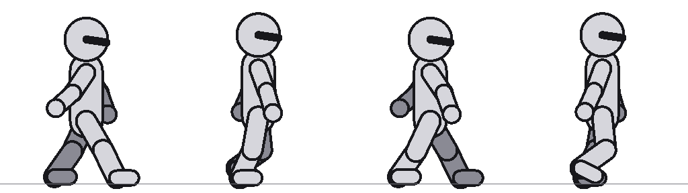
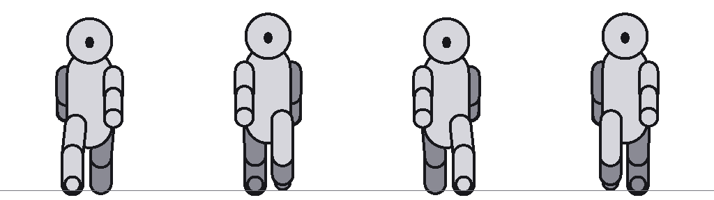
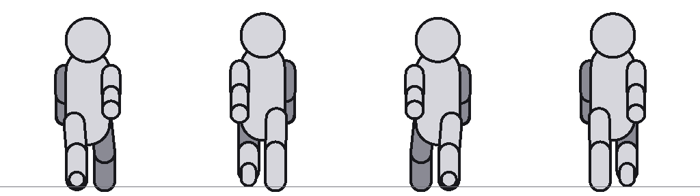

# Prompts Gemini — un bloc autonome par entité

**Chaque bloc de code se copie-colle tel quel, seul.** Rien à assembler, rien à compléter :
le style, le format, les contraintes et le sujet y sont déjà réunis.

> Généré par `tools/prompts/build.cjs` — **ne pas éditer à la main**, la prochaine
> exécution écraserait la correction.

Les règles d'intégration (renommage, chemins, licence) restent dans
[REFONTE-GRAPHIQUE-GEMINI.md](REFONTE-GRAPHIQUE-GEMINI.md).

> ⚠ Ne jamais ajouter le mot « sticker » au prompt : Gemini rajoute alors un liseré blanc de découpe.

---

# Comment on travaille

1. Copier le bloc de la créature, le coller dans Gemini, récupérer l'image.
2. La déposer dans `G:\Romain\Téléchargements\Monstre rework\` sous le nom de la créature.
3. Passer la commande indiquée sous le bloc.
4. **Lire les avertissements de l'outil, puis faire la revue ci-dessous.**

L'étape 4 n'est pas une formalité. Les trois premiers monstres ont chacun demandé
plusieurs passes parce qu'un défaut était passé au travers.

## La revue, dans l'ordre

| # | Contrôle | Qui le fait | Si ça cloche |
|---|---|---|---|
| 1 | **Le cycle bouge-t-il ?** | l'outil, automatiquement | ⚠ `MÊME image` ou `aucune alternance` → **régénérer**, rien ne se rattrape |
| 2 | **Chaque case regarde-t-elle à droite ?** (rangée de profil) | à l'oeil, case par case | `--profile-left` si toute la rangée, `--mirror <rangée>:<pose>` si une seule case |
| 3 | **L'équipement reste-t-il dans la même main ?** | à l'oeil, rangée par rangée | `--mirror` si le dessin est inversé, `--drop` si c'est l'autre flanc du personnage |
| 4 | **Reste-t-il du blanc entre un bras et le torse ?** | l'outil recense, l'oeil tranche | `--fill-holes` après avoir vérifié qu'aucune poche n'est un reflet ou un oeil |
| 5 | **Les pieds touchent-ils la ligne de sol ?** | l'outil (`écart au sol`) | régénérer si l'écart dépasse quelques pixels |

Contrôles 2 et 3 : regarder la planche **PRODUITE**, jamais l'image source, et
**case par case**. J'ai lu l'orientation à l'oeil sur une vignette source et je me suis
trompé deux fois de suite ; le générateur se trompe case par case, pas rangée par rangée.

## Chiffres de référence pour le contrôle 1

Écart entre deux poses d'une même rangée, mesuré **sur les jambes seules** :

| planche | écart maximal | verdict |
|---|---|---|
| une planche qui marche vraiment | **60 à 66 %** | bon |
| planches refusées jusqu'ici | 16 à 26 % | glisse |
| deux poses dupliquées | 1 à 5 % | la même image |

---

# 1. Créatures qui MARCHENT — une direction à la fois

**Format en vigueur** (ADR-073/074). Le prompt ne décrit plus les poses : il pointe vers un
gabarit joint. C'est le seul format qui ait produit une rangée de face correcte.

Le corps du prompt est le MÊME pour toutes les créatures. Seule la dernière ligne change :
recopier le `Sujet :` de la créature, dans la liste plus bas.

**Ordre de travail** — commencer par le PROFIL, le seul format qui ait jamais réussi, puis
chaîner : joindre l'image obtenue aux deux générations suivantes, pour que le personnage ne
dérive pas.

## Prompt 1 — le PROFIL (à faire en premier)

Joindre cette image au prompt :



Fichier : [`docs/gabarits/gabarit-profil.png`](gabarits/gabarit-profil.png).
Pour le régénérer : `npm run mannequin -- gabarit-profil.png --view side`.

```
Voici une image de référence : un mannequin gris en 4 cases.

Elle ne montre pas à quoi ressemble le personnage. Elle montre juste la
position de ses bras et de ses jambes, case par case.

Comment la lire :
- Vu de PROFIL : il marche vers la droite de l'image.
- Le gris plus foncé, c'est le bras ou la jambe le plus loin de toi — une ombre légère suffit à le montrer.
- Le trait noir sur la tête, c'est le nez : juste un repère pour savoir où regarde le personnage.
- La ligne grise horizontale, c'est le sol.

TA TÂCHE : dessine le personnage décrit plus bas, dans les 4 poses du mannequin.

Règles, dans l'ordre d'importance :

1. Copie exactement la pose de chaque case : mêmes angles de bras et de jambes, même jambe
   en avant, même pied levé. Ne change rien à la pose.

2. Le personnage est rigoureusement identique dans les 4 cases : mêmes couleurs, mêmes
   proportions, même équipement. Seule la position des bras et des jambes change.

3. Il reste vu de PROFIL dans les 4 cases (toujours le même côté du corps, jamais l'autre).

4. Une ligne de sol fine et grise, sous les pieds, traverse toute l'image sans interruption.

5. Fond blanc uni. Pas de cadre, pas de grille visible, pas de texte, pas d'ombre portée au sol.

6. Le personnage peut être plus grand ou plus large que le mannequin : seule sa pose doit
   correspondre, pas sa carrure.

Art de jeu vidéo cartoon fantasy : couleurs saturées avec modelé peint à l'intérieur des formes (volumes, ombres et lumières, jamais des aplats plats), épais contour NOIR uniforme sur tout le pourtour du personnage.
Le contour extérieur est noir et rien d'autre : aucun liseré blanc, aucun halo, aucune bordure de découpe autour de la silhouette.
Proportions stylisées, pas réalistes : tête surdimensionnée, corps compact.
Chaque case doit rester lisible réduite à 50 px de haut.

Sujet : [recopier ici la ligne Sujet de la créature]
```

## Prompt 2 — la FACE

Une fois le profil validé, joindre DEUX images : lui, et le gabarit de face. Le générateur a
le personnage sous les yeux, pas seulement sa description — c'est le chaînage.



Fichier : [`docs/gabarits/gabarit-face.png`](gabarits/gabarit-face.png).
Pour le régénérer : `npm run mannequin -- gabarit-face.png --view front`.

```
Tu donnes DEUX images.

IMAGE 1 : le personnage déjà dessiné, en 4 poses de marche. C'est LUI qu'il faut redessiner —
mêmes couleurs, mêmes proportions, même équipement, même style de trait.

IMAGE 2 : un mannequin gris en 4 cases qui montre les poses à prendre.

L'image 2 ne montre pas à quoi ressemble le personnage. Elle montre juste la
position de ses bras et de ses jambes, case par case.

Comment la lire :
- Vu de FACE : il marche droit vers toi.
- Le gris plus foncé, c'est le bras ou la jambe le plus loin de toi — une ombre légère suffit à le montrer.
- Le trait noir sur la tête, c'est le nez : juste un repère pour savoir où regarde le personnage.
- La ligne grise horizontale, c'est le sol.

TA TÂCHE : dessine le personnage de l'image 1, dans les poses de l'image 2.

Règles, dans l'ordre d'importance :

1. Copie exactement la pose de chaque case : mêmes angles de bras et de jambes, même jambe
   en avant, même pied levé. Ne change rien à la pose.

2. Le personnage doit rester reconnaissable comme celui de l'image 1 : mêmes couleurs, mêmes
   proportions, même équipement, même style de trait, et la même taille à l'écran (du sol au
   sommet de la tête).

3. Il reste vu de FACE dans les 4 cases (jamais de profil, jamais de trois-quarts).

4. Une ligne de sol fine et grise, sous les pieds, traverse toute l'image sans interruption.

5. Fond blanc uni. Pas de cadre, pas de grille visible, pas de texte, pas d'ombre portée au sol.

Art de jeu vidéo cartoon fantasy : couleurs saturées avec modelé peint à l'intérieur des formes (volumes, ombres et lumières, jamais des aplats plats), épais contour NOIR uniforme sur tout le pourtour du personnage.
Le contour extérieur est noir et rien d'autre : aucun liseré blanc, aucun halo, aucune bordure de découpe autour de la silhouette.
Proportions stylisées, pas réalistes : tête surdimensionnée, corps compact.
Chaque case doit rester lisible réduite à 50 px de haut.
```

## Prompt 3 — le DOS

Même principe, avec le gabarit de dos.



Fichier : [`docs/gabarits/gabarit-dos.png`](gabarits/gabarit-dos.png).
Pour le régénérer : `npm run mannequin -- gabarit-dos.png --view back`.

```
Tu donnes DEUX images.

IMAGE 1 : le personnage déjà dessiné, en 4 poses de marche. C'est LUI qu'il faut redessiner —
mêmes couleurs, mêmes proportions, même équipement, même style de trait.

IMAGE 2 : un mannequin gris en 4 cases qui montre les poses à prendre.

L'image 2 ne montre pas à quoi ressemble le personnage. Elle montre juste la
position de ses bras et de ses jambes, case par case.

Comment la lire :
- Vu de DOS : il s'éloigne de toi.
- Le gris plus foncé, c'est le bras ou la jambe le plus loin de toi — une ombre légère suffit à le montrer.
- Le trait noir sur la tête, c'est le nez : juste un repère pour savoir où regarde le personnage.
- La ligne grise horizontale, c'est le sol.

TA TÂCHE : dessine le personnage de l'image 1, dans les poses de l'image 2.

Règles, dans l'ordre d'importance :

1. Copie exactement la pose de chaque case : mêmes angles de bras et de jambes, même jambe
   en avant, même pied levé. Ne change rien à la pose.

2. Le personnage doit rester reconnaissable comme celui de l'image 1 : mêmes couleurs, mêmes
   proportions, même équipement, même style de trait, et la même taille à l'écran (du sol au
   sommet de la tête).

3. Il reste vu de DOS dans les 4 cases (jamais de profil, jamais de trois-quarts).

4. Une ligne de sol fine et grise, sous les pieds, traverse toute l'image sans interruption.

5. Fond blanc uni. Pas de cadre, pas de grille visible, pas de texte, pas d'ombre portée au sol.

Art de jeu vidéo cartoon fantasy : couleurs saturées avec modelé peint à l'intérieur des formes (volumes, ombres et lumières, jamais des aplats plats), épais contour NOIR uniforme sur tout le pourtour du personnage.
Le contour extérieur est noir et rien d'autre : aucun liseré blanc, aucun halo, aucune bordure de découpe autour de la silhouette.
Proportions stylisées, pas réalistes : tête surdimensionnée, corps compact.
Chaque case doit rester lisible réduite à 50 px de haut.
```

## Les sujets, un par créature

| créature | `Sujet :` à recopier |
|---|---|
| **Diablotin de faille** (`diablotin`, taille 38) | petit diablotin violacé maigrichon, cornes courtes recourbées, grandes oreilles pointues, yeux jaunes luisants sans pupille, veines de lumière magenta courant sous la peau. Créature la plus faible du bestiaire : chétive, échine légèrement voûtée, mais en marche décidée. Mains nues, aucune arme. |
| **Gobelin** (`goblin`, taille 46) | gobelin à la peau vert-de-gris, air hargneux, silhouette trapue. Armure de bric-à-brac faite de plaques dépareillées, casque de fer cabossé trop grand pour lui enfoncé jusqu'aux oreilles. Courte épée rouillée tenue basse dans la main DROITE, petit bouclier rond de planches clouées au bras GAUCHE. |
| **Orc** (`orc`, taille 54) | orc guerrier massif à la peau vert olive, mâchoire lourde aux défenses inférieures proéminentes, petits yeux enfoncés. Épaules très larges, cou épais. Plastron de cuir clouté sur torse nu, brassards de fer. Hache de guerre large à une main, tenue basse dans la main DROITE. |
| **Troll** (`troll`, taille 56) | troll gris-bleu voûté, peau rugueuse et verruqueuse, long nez crochu, oreilles tombantes, quelques touffes de cheveux filasse. Bras démesurés descendant presque au sol. Gourdin de bois brut traîné de la main DROITE. Dos courbé, épaules remontées. |
| **Chevalier noir** (`dark_knight`, taille 58) | chevalier en armure de plates noire mate, heaume clos dont la visière étroite laisse filtrer une lueur rouge, aucune peau visible. Cape sombre déchirée en bas. Épée longue tenue pointe vers le bas le long de la jambe, dans la main DROITE. Élégant, martial et menaçant, surtout pas monstrueux ni difforme. |
| **Brute** (`brute`, taille 62) | mort-vivant colossal et boursouflé, chair grisâtre verdâtre marquée de grosses sutures, mâchoire pendante, yeux laiteux. Le bras DROIT est nettement hypertrophié et pendant, le bras GAUCHE atrophié. Chaînes brisées aux poignets, lambeaux de tissu sale à la taille. Démarche lourde et déséquilibrée. |
| **Ogre** (`ogre`, taille 66) | ogre énorme et bedonnant à la peau brun-rose, ventre proéminent, une seule grosse dent supérieure dépassant de la lèvre, petits yeux stupides. Corps très large, tête petite par rapport au tronc, exception à la règle de grosse tête. Pagne de peaux de bêtes, massue cloutée posée sur l'épaule DROITE. |
| **Golem de fer** (`golem`, taille 70) | golem construit de lourdes plaques de fer rivetées, articulations mécaniques apparentes aux épaules et aux genoux, rouille sur les arêtes. Tête cubique sans visage, traversée d'une unique fente lumineuse bleu froid. Poings surdimensionnés, aucune arme. Démarche pesante et rigide. |
| **Chef de guerre** (`warlord`, taille 72) | seigneur de guerre orc, chef de bande. Armure lourde sombre ornée de crânes et de trophées, épaulières hérissées de pointes, casque à grandes cornes recourbées, cape de fourrure épaisse sur les épaules. Énorme épée à deux mains portée sur l'épaule DROITE. Silhouette de boss : la plus imposante et la plus large des créatures humanoïdes. |
| **Pillard des Frontières** (`frontier_raider`, taille 50) | bandit humain encapuchonné, silhouette agile et sèche. Capuche brune rabattue, écharpe sombre masquant le bas du visage, seuls les yeux visibles. Cuir clouté brun et sangles croisées sur le torse, ceinture garnie de petites fioles. Une dague courbe dans chaque main, tenues basses. |
| **Maraudeur des Failles** (`rift_marauder`, taille 50) | guerrier humain corrompu par une magie de faille. Armure de plates grise fendue de longues fissures d'où s'échappe une lumière VIOLETTE intense. Le bras GAUCHE est entièrement cristallisé en éclats violets translucides remplaçant la chair. Heaume ouvert révélant un regard vide luminescent. Épée courte dans la main DROITE. |
| **Gardien des Ombres** (`shade_warder`, taille 52) | sentinelle d'ombre élancée. Corps fait de fumée noire dense, maintenu en forme humanoïde par des sangles et des pièces d'armure argentées flottant à leur place : épaulières, brassards, ceinturon. Visage sans traits, deux fentes lumineuses blanches. Fine lame courbe argentée dans la main DROITE. Volutes sombres s'échappant des épaules. Les deux jambes restent nettement dessinées et distinctes. |
| **Assassin Voilé** (`veiled_assassin`, taille 54) | assassin drapé de voiles gris-bleu en mouvement, écharpes flottant derrière lui. Visage entièrement masqué de bandelettes, aucun trait visible. Tenue ajustée sombre sous les voiles. Un poignard tenu en prise inversée dans chaque main, lames le long des avant-bras. Allure furtive mais avançant franchement. Les voiles ne doivent jamais masquer les jambes. |
| **Gardien à Quatre Yeux** (`four_eyed_warden`, taille 58) | aberration humanoïde trapue à la peau bleu-gris coriace et plissée. QUATRE yeux jaunes disposés en losange sur un visage sans nez, bouche large et fine. Épaulières de pierre brute sanglées, pagne de cuir. Bâton-totem de bois noueux surmonté d'un fétiche osseux, tenu verticalement dans la main DROITE. Cou inexistant, épaules massives. |
| **Ermite Corrompu** (`corrupted_hermit`, taille 64) | vieil ermite en haillons de toile grise, longue barbe emmêlée, dos courbé, appuyé sur un bâton de bois noueux tenu dans la main DROITE. La moitié GAUCHE de son corps est envahie par la corruption : cristaux violets translucides poussant hors de l'épaule et du bras, racines noires courant sur la peau, œil de ce côté remplacé par une lueur violette. L'autre moitié reste humaine et misérable. Contraste net entre les deux moitiés. |
| **Ossements Hurlants** (`howling_bones`, taille 68) | amas de plusieurs squelettes fusionnés en une seule créature humanoïde. Deux cages thoraciques imbriquées formant le tronc, os surnuméraires saillant des épaules, bras composés de plusieurs avant-bras. Plusieurs crânes : un crâne principal bouche grande ouverte en plein hurlement, deux crânes secondaires soudés aux épaules. Flamme verte pâle dans chaque orbite. Os jaunis et fêlés. Les deux jambes restent complètes et séparées. |
| **Le Roi Fangeux, BOSS** (`the_gravedigger`, taille 82) | BOSS FINAL du jeu. Roi mort-vivant colossal, silhouette écrasante et beaucoup plus large que tous les autres monstres. Couronne de fer tordue et rouillée enfoncée sur un crâne boursouflé, deux yeux verts luisants et haineux. Corps de boue et de chair putréfiée mêlée de racines noires, manteau de fange dégoulinante sur les épaules. Immense pelle-hache de fossoyeur tenue dans la main DROITE. Doit dominer par la présence : le monstre le plus imposant du bestiaire. |
| **Héros du joueur** (`hero`) | chevalier héroïque, armure de plates d'acier CLAIR et lumineux à liserés dorés : la clarté de l'armure doit le distinguer instantanément des monstres sombres qui l'entourent. Heaume à visière ouverte laissant voir un regard déterminé, plumet ou crête sur le casque. Grand bouclier armorié au bras GAUCHE, blason au griffon. Épée longue à garde dorée dans la main DROITE, pointe vers le bas. Cape bleue. |

---

# 1 bis. Format ABANDONNÉ — la planche 3 × 4 d'un seul bloc

Conservé pour mémoire, et parce qu'il documente ce qui a été essayé. **Ne pas l'utiliser** :
cinq planches sur cinq ont échoué dans ce format, le générateur décrochant sur le profil et
le dos. Les blocs ci-dessous sont ceux de cette tentative.

Format retenu pour toute créature posée au sol sur deux jambes (ADR-067).
La marche vers la GAUCHE n'est pas demandée : c'est le miroir du profil droit,
calculé sans erreur possible. Six poses de moins, donc plus de pixels pour chacune.

## Joindre le gabarit de poses (ADR-073)

Le prompt a été durci quatre fois sans obtenir des poses fiables. Un gabarit dessiné les
MONTRE au lieu de les décrire — squelette gris sans visage ni équipement, trois vues x quatre
poses, membre éloigné assombri pour qu'on voie quelle jambe est devant.

```bash
npm run mannequin -- gabarit-poses.png
```

Joindre l'image au prompt, en demandant d'habiller le gabarit sans changer les poses.

## Une direction à la fois (ADR-074)

Le générateur tient quatre cases et décroche sur douze : mesuré, une planche 3x4 rend un
profil à deux poses dupliquées et un dos immobile. On demande donc UNE rangée par image,
avec le gabarit de la direction correspondante.

```bash
npm run mannequin -- gabarit-face.png --view front
npm run mannequin -- gabarit-profil.png --view side
npm run mannequin -- gabarit-dos.png --view back
```

Commencer par le PROFIL : c'est le seul format qui ait jamais réussi. Joindre ensuite
l'image obtenue aux deux générations suivantes, pour que le personnage ne dérive pas.

Puis recoller les trois images, dans l'ordre face, profil, dos :

```bash
npm run sprite -- face.png profil.png dos.png public/assets/skin-craftpix/<defId>.png --strip --poses 4 --views fsb --fill-holes
```

**`--views` n'est pas optionnel.** Le juge de cycle applique au profil un seuil deux fois plus
exigeant qu'aux vues frontales ; sans cette déclaration il prend toute planche d'une seule
rangée pour un profil, et refuse une rangée de face pourtant correcte.

Pour traiter une rangée seule, en cours de mise au point :

```bash
npm run sprite -- face.png sortie.png --strip --poses 4 --views f
```

Commande de traitement, la même pour toutes :

```bash
npm run sprite -- "G:/Romain/Téléchargements/Monstre rework/<source>.png" public/assets/skin-craftpix/<defId>.png --strip --poses 4 --fill-holes
```

## `diablotin.png` — Diablotin de faille (taille 38)

```
Planche de sprites d'un personnage de jeu vidéo : UNE seule image organisée en TROIS RANGÉES et QUATRE COLONNES, soit douze cases.

RÈGLE ABSOLUE 1 — LE PERSONNAGE NE CHANGE JAMAIS :
- Exactement les mêmes couleurs dans les douze cases, teinte pour teinte. Aucune variation de saturation, de luminosité ou de nuance, même très légère.
- Exactement les mêmes proportions, la même taille, le même équipement, les mêmes détails. Rien n'apparaît ni ne disparaît d'une case à l'autre.
- Même éclairage partout, venant de la même direction.
- Même style de trait et même épaisseur de contour dans les douze cases.
- SEULE EXCEPTION autorisée : le membre le plus ÉLOIGNÉ du spectateur (bras ou jambe arrière) est peint dans une teinte légèrement plus sombre, comme dans tous les cycles de marche classiques. C'est ce qui permet de voir lequel des deux est devant.

RÈGLE ABSOLUE 2 — LE PERSONNAGE NE TOURNE PAS :
- À l'intérieur d'une rangée, l'angle de vue est rigoureusement identique d'une case à l'autre. Le personnage ne pivote pas, ne se tourne pas de trois-quarts, ne montre jamais l'autre côté de son corps.
- Il ne tourne pas PROGRESSIVEMENT au fil des cases. La quatrième case est vue sous exactement le même angle que la première. Une rangée qui commence de face et finit de trois-quarts est un ÉCHEC.
- Aucun saut, aucun accroupissement, aucune génuflexion, aucune torsion du buste, aucune pose d'attaque, aucune pose de repos.
- Le sommet de la tête reste à la même hauteur dans les quatre cases d'une rangée : le personnage AVANCE, il ne monte ni ne descend.

Chaque RANGÉE montre le même personnage sous un angle différent :
- Rangée du HAUT : de FACE STRICTE dans les quatre cases. Les épaules restent parallèles au bord de l'image, le nez pointe vers le spectateur, on voit les deux côtés du visage à parts égales. Le personnage marche vers le spectateur, il ne s'éloigne jamais sur le côté.
- Rangée du MILIEU : de PROFIL STRICT dans les quatre cases, marchant vers la DROITE de l'image. On voit exactement un seul côté du corps, jamais l'autre.
- Rangée du BAS : de DOS STRICT dans les quatre cases, s'éloignant droit du spectateur. Les épaules restent parallèles au bord de l'image.

Les trois rangées montrent LE MÊME cycle de marche, avec la MÊME amplitude de jambes. La rangée du BAS n'est pas une pose debout : c'est la même marche, vue de derrière.

Chaque rangée contient QUATRE poses successives d'un même pas, de gauche à droite :
1. CONTACT : cuisse GAUCHE en avant, environ 30 degrés devant la verticale ; cuisse DROITE en arrière, environ 25 degrés derrière. Les deux pieds posés au sol. Bras DROIT porté en avant, coude à demi plié, main à hauteur de hanche ; bras GAUCHE en arrière, presque tendu.
2. PASSAGE : la jambe DROITE remonte et croise la gauche, genou droit plié à environ 60 degrés, pied droit nettement décollé du sol. Les deux jambes presque jointes. Les deux bras passent près du corps, à la verticale.
3. CONTACT INVERSE : l'exact inverse de la pose 1. Cuisse DROITE en avant à 30 degrés, cuisse GAUCHE en arrière à 25 degrés, les deux pieds au sol. Bras GAUCHE porté en avant, bras DROIT en arrière.
4. PASSAGE INVERSE : l'exact inverse de la pose 2. La jambe GAUCHE remonte et croise la droite, genou gauche plié, pied gauche nettement décollé.

LES DEUX JAMBES ALTERNENT — c'est le point le plus important de la planche :
- Aux poses 1 et 3, ce n'est PAS la même jambe qui est devant. La pose 3 est le miroir exact de la pose 1 quant aux jambes.
- En vue de PROFIL, on doit voir laquelle des deux jambes est la plus proche du spectateur : elle masque partiellement l'autre, et l'autre est peinte plus sombre. Pose 1 : c'est la jambe GAUCHE qui est devant et masque la droite. Pose 3 : c'est la jambe DROITE qui est devant et masque la gauche.
- Une rangée où la même jambe reste devant sur les quatre cases n'est pas une marche : c'est un balancement sur place, et c'est un ÉCHEC.
- Même exigence de face et de dos : la jambe qui avance change à chaque pose de contact.

BALANCIER DES BRAS — aucun bras immobile :
- Le bras porté en avant est TOUJOURS celui du côté OPPOSÉ à la jambe portée en avant. C'est la règle du balancier, sans aucune exception dans les douze cases.
- Aux poses de CONTACT, l'écart entre les deux mains est maximal.
- Si le personnage tient une arme, le bras armé balance comme l'autre. L'arme ne change jamais de main et garde la même orientation.
- Un bras qui reste collé au corps sur les quatre poses est un ÉCHEC.

LES JAMBES SONT LE SUJET PRINCIPAL DE CETTE PLANCHE :
- Aux poses de CONTACT, la distance entre les deux talons vaut environ la MOITIÉ de la hauteur totale du personnage. C'est une grande enjambée, pas un pas timide.
- Aux poses de PASSAGE, les deux jambes se touchent presque.
- Les quatre poses d'une même rangée doivent être NETTEMENT différentes au niveau des jambes. Ne jamais redessiner deux fois la même position de jambes. Faire varier les bras sans faire varier les jambes est un ÉCHEC.

CADRE :
- Échelle rigoureusement identique dans les douze cases.
- Une LIGNE DE SOL horizontale fine, grise, traverse toute la largeur de l'image SOUS CHAQUE RANGÉE, d'un bord à l'autre et sans interruption. Les pieds posés de chaque pose la touchent exactement.
- Espacement régulier et LARGE entre les colonnes. Aucun chevauchement entre deux poses, y compris les armes.
- Aucun aplat de fond blanc enfermé entre un bras et le torse : si le bras s'écarte du corps, le vide entre les deux doit être franchement ouvert sur le fond.
- Fond BLANC UNI. Aucun cadre, aucune grille, aucune séparation verticale, aucun numéro, aucun texte, aucune ombre portée.

AVANT DE RENDRE L'IMAGE, VÉRIFIER LES TROIS POINTS SUIVANTS :
1. Dans chaque rangée, la jambe qui est devant à la pose 1 est bien celle qui est DERRIÈRE à la pose 3.
2. Dans chaque rangée, les quatre cases sont vues sous le même angle : la case 4 n'est pas plus tournée que la case 1.
3. Les couleurs du personnage sont identiques dans les douze cases.

Art de jeu vidéo cartoon fantasy : couleurs saturées avec modelé peint à l'intérieur des formes (volumes, ombres et lumières, jamais des aplats plats), épais contour NOIR uniforme sur tout le pourtour du personnage.
Le contour extérieur est noir et rien d'autre : aucun liseré blanc, aucun halo, aucune bordure de découpe autour de la silhouette.
Proportions stylisées, pas réalistes : tête surdimensionnée, corps compact.
Chaque case doit rester lisible réduite à 50 px de haut : silhouette franche, détails minimaux.

Sujet : petit diablotin violacé maigrichon, cornes courtes recourbées, grandes oreilles pointues, yeux jaunes luisants sans pupille, veines de lumière magenta courant sous la peau. Créature la plus faible du bestiaire : chétive, échine légèrement voûtée, mais en marche décidée. Mains nues, aucune arme.
```

## `goblin.png` — Gobelin (taille 46)

```
Planche de sprites d'un personnage de jeu vidéo : UNE seule image organisée en TROIS RANGÉES et QUATRE COLONNES, soit douze cases.

RÈGLE ABSOLUE 1 — LE PERSONNAGE NE CHANGE JAMAIS :
- Exactement les mêmes couleurs dans les douze cases, teinte pour teinte. Aucune variation de saturation, de luminosité ou de nuance, même très légère.
- Exactement les mêmes proportions, la même taille, le même équipement, les mêmes détails. Rien n'apparaît ni ne disparaît d'une case à l'autre.
- Même éclairage partout, venant de la même direction.
- Même style de trait et même épaisseur de contour dans les douze cases.
- SEULE EXCEPTION autorisée : le membre le plus ÉLOIGNÉ du spectateur (bras ou jambe arrière) est peint dans une teinte légèrement plus sombre, comme dans tous les cycles de marche classiques. C'est ce qui permet de voir lequel des deux est devant.

RÈGLE ABSOLUE 2 — LE PERSONNAGE NE TOURNE PAS :
- À l'intérieur d'une rangée, l'angle de vue est rigoureusement identique d'une case à l'autre. Le personnage ne pivote pas, ne se tourne pas de trois-quarts, ne montre jamais l'autre côté de son corps.
- Il ne tourne pas PROGRESSIVEMENT au fil des cases. La quatrième case est vue sous exactement le même angle que la première. Une rangée qui commence de face et finit de trois-quarts est un ÉCHEC.
- Aucun saut, aucun accroupissement, aucune génuflexion, aucune torsion du buste, aucune pose d'attaque, aucune pose de repos.
- Le sommet de la tête reste à la même hauteur dans les quatre cases d'une rangée : le personnage AVANCE, il ne monte ni ne descend.

Chaque RANGÉE montre le même personnage sous un angle différent :
- Rangée du HAUT : de FACE STRICTE dans les quatre cases. Les épaules restent parallèles au bord de l'image, le nez pointe vers le spectateur, on voit les deux côtés du visage à parts égales. Le personnage marche vers le spectateur, il ne s'éloigne jamais sur le côté.
- Rangée du MILIEU : de PROFIL STRICT dans les quatre cases, marchant vers la DROITE de l'image. On voit exactement un seul côté du corps, jamais l'autre.
- Rangée du BAS : de DOS STRICT dans les quatre cases, s'éloignant droit du spectateur. Les épaules restent parallèles au bord de l'image.

Les trois rangées montrent LE MÊME cycle de marche, avec la MÊME amplitude de jambes. La rangée du BAS n'est pas une pose debout : c'est la même marche, vue de derrière.

Chaque rangée contient QUATRE poses successives d'un même pas, de gauche à droite :
1. CONTACT : cuisse GAUCHE en avant, environ 30 degrés devant la verticale ; cuisse DROITE en arrière, environ 25 degrés derrière. Les deux pieds posés au sol. Bras DROIT porté en avant, coude à demi plié, main à hauteur de hanche ; bras GAUCHE en arrière, presque tendu.
2. PASSAGE : la jambe DROITE remonte et croise la gauche, genou droit plié à environ 60 degrés, pied droit nettement décollé du sol. Les deux jambes presque jointes. Les deux bras passent près du corps, à la verticale.
3. CONTACT INVERSE : l'exact inverse de la pose 1. Cuisse DROITE en avant à 30 degrés, cuisse GAUCHE en arrière à 25 degrés, les deux pieds au sol. Bras GAUCHE porté en avant, bras DROIT en arrière.
4. PASSAGE INVERSE : l'exact inverse de la pose 2. La jambe GAUCHE remonte et croise la droite, genou gauche plié, pied gauche nettement décollé.

LES DEUX JAMBES ALTERNENT — c'est le point le plus important de la planche :
- Aux poses 1 et 3, ce n'est PAS la même jambe qui est devant. La pose 3 est le miroir exact de la pose 1 quant aux jambes.
- En vue de PROFIL, on doit voir laquelle des deux jambes est la plus proche du spectateur : elle masque partiellement l'autre, et l'autre est peinte plus sombre. Pose 1 : c'est la jambe GAUCHE qui est devant et masque la droite. Pose 3 : c'est la jambe DROITE qui est devant et masque la gauche.
- Une rangée où la même jambe reste devant sur les quatre cases n'est pas une marche : c'est un balancement sur place, et c'est un ÉCHEC.
- Même exigence de face et de dos : la jambe qui avance change à chaque pose de contact.

BALANCIER DES BRAS — aucun bras immobile :
- Le bras porté en avant est TOUJOURS celui du côté OPPOSÉ à la jambe portée en avant. C'est la règle du balancier, sans aucune exception dans les douze cases.
- Aux poses de CONTACT, l'écart entre les deux mains est maximal.
- Si le personnage tient une arme, le bras armé balance comme l'autre. L'arme ne change jamais de main et garde la même orientation.
- Un bras qui reste collé au corps sur les quatre poses est un ÉCHEC.

LES JAMBES SONT LE SUJET PRINCIPAL DE CETTE PLANCHE :
- Aux poses de CONTACT, la distance entre les deux talons vaut environ la MOITIÉ de la hauteur totale du personnage. C'est une grande enjambée, pas un pas timide.
- Aux poses de PASSAGE, les deux jambes se touchent presque.
- Les quatre poses d'une même rangée doivent être NETTEMENT différentes au niveau des jambes. Ne jamais redessiner deux fois la même position de jambes. Faire varier les bras sans faire varier les jambes est un ÉCHEC.

CADRE :
- Échelle rigoureusement identique dans les douze cases.
- Une LIGNE DE SOL horizontale fine, grise, traverse toute la largeur de l'image SOUS CHAQUE RANGÉE, d'un bord à l'autre et sans interruption. Les pieds posés de chaque pose la touchent exactement.
- Espacement régulier et LARGE entre les colonnes. Aucun chevauchement entre deux poses, y compris les armes.
- Aucun aplat de fond blanc enfermé entre un bras et le torse : si le bras s'écarte du corps, le vide entre les deux doit être franchement ouvert sur le fond.
- Fond BLANC UNI. Aucun cadre, aucune grille, aucune séparation verticale, aucun numéro, aucun texte, aucune ombre portée.

AVANT DE RENDRE L'IMAGE, VÉRIFIER LES TROIS POINTS SUIVANTS :
1. Dans chaque rangée, la jambe qui est devant à la pose 1 est bien celle qui est DERRIÈRE à la pose 3.
2. Dans chaque rangée, les quatre cases sont vues sous le même angle : la case 4 n'est pas plus tournée que la case 1.
3. Les couleurs du personnage sont identiques dans les douze cases.

Art de jeu vidéo cartoon fantasy : couleurs saturées avec modelé peint à l'intérieur des formes (volumes, ombres et lumières, jamais des aplats plats), épais contour NOIR uniforme sur tout le pourtour du personnage.
Le contour extérieur est noir et rien d'autre : aucun liseré blanc, aucun halo, aucune bordure de découpe autour de la silhouette.
Proportions stylisées, pas réalistes : tête surdimensionnée, corps compact.
Chaque case doit rester lisible réduite à 50 px de haut : silhouette franche, détails minimaux.

Sujet : gobelin à la peau vert-de-gris, air hargneux, silhouette trapue. Armure de bric-à-brac faite de plaques dépareillées, casque de fer cabossé trop grand pour lui enfoncé jusqu'aux oreilles. Courte épée rouillée tenue basse dans la main DROITE, petit bouclier rond de planches clouées au bras GAUCHE.
```

## `orc.png` — Orc (taille 54)

```
Planche de sprites d'un personnage de jeu vidéo : UNE seule image organisée en TROIS RANGÉES et QUATRE COLONNES, soit douze cases.

RÈGLE ABSOLUE 1 — LE PERSONNAGE NE CHANGE JAMAIS :
- Exactement les mêmes couleurs dans les douze cases, teinte pour teinte. Aucune variation de saturation, de luminosité ou de nuance, même très légère.
- Exactement les mêmes proportions, la même taille, le même équipement, les mêmes détails. Rien n'apparaît ni ne disparaît d'une case à l'autre.
- Même éclairage partout, venant de la même direction.
- Même style de trait et même épaisseur de contour dans les douze cases.
- SEULE EXCEPTION autorisée : le membre le plus ÉLOIGNÉ du spectateur (bras ou jambe arrière) est peint dans une teinte légèrement plus sombre, comme dans tous les cycles de marche classiques. C'est ce qui permet de voir lequel des deux est devant.

RÈGLE ABSOLUE 2 — LE PERSONNAGE NE TOURNE PAS :
- À l'intérieur d'une rangée, l'angle de vue est rigoureusement identique d'une case à l'autre. Le personnage ne pivote pas, ne se tourne pas de trois-quarts, ne montre jamais l'autre côté de son corps.
- Il ne tourne pas PROGRESSIVEMENT au fil des cases. La quatrième case est vue sous exactement le même angle que la première. Une rangée qui commence de face et finit de trois-quarts est un ÉCHEC.
- Aucun saut, aucun accroupissement, aucune génuflexion, aucune torsion du buste, aucune pose d'attaque, aucune pose de repos.
- Le sommet de la tête reste à la même hauteur dans les quatre cases d'une rangée : le personnage AVANCE, il ne monte ni ne descend.

Chaque RANGÉE montre le même personnage sous un angle différent :
- Rangée du HAUT : de FACE STRICTE dans les quatre cases. Les épaules restent parallèles au bord de l'image, le nez pointe vers le spectateur, on voit les deux côtés du visage à parts égales. Le personnage marche vers le spectateur, il ne s'éloigne jamais sur le côté.
- Rangée du MILIEU : de PROFIL STRICT dans les quatre cases, marchant vers la DROITE de l'image. On voit exactement un seul côté du corps, jamais l'autre.
- Rangée du BAS : de DOS STRICT dans les quatre cases, s'éloignant droit du spectateur. Les épaules restent parallèles au bord de l'image.

Les trois rangées montrent LE MÊME cycle de marche, avec la MÊME amplitude de jambes. La rangée du BAS n'est pas une pose debout : c'est la même marche, vue de derrière.

Chaque rangée contient QUATRE poses successives d'un même pas, de gauche à droite :
1. CONTACT : cuisse GAUCHE en avant, environ 30 degrés devant la verticale ; cuisse DROITE en arrière, environ 25 degrés derrière. Les deux pieds posés au sol. Bras DROIT porté en avant, coude à demi plié, main à hauteur de hanche ; bras GAUCHE en arrière, presque tendu.
2. PASSAGE : la jambe DROITE remonte et croise la gauche, genou droit plié à environ 60 degrés, pied droit nettement décollé du sol. Les deux jambes presque jointes. Les deux bras passent près du corps, à la verticale.
3. CONTACT INVERSE : l'exact inverse de la pose 1. Cuisse DROITE en avant à 30 degrés, cuisse GAUCHE en arrière à 25 degrés, les deux pieds au sol. Bras GAUCHE porté en avant, bras DROIT en arrière.
4. PASSAGE INVERSE : l'exact inverse de la pose 2. La jambe GAUCHE remonte et croise la droite, genou gauche plié, pied gauche nettement décollé.

LES DEUX JAMBES ALTERNENT — c'est le point le plus important de la planche :
- Aux poses 1 et 3, ce n'est PAS la même jambe qui est devant. La pose 3 est le miroir exact de la pose 1 quant aux jambes.
- En vue de PROFIL, on doit voir laquelle des deux jambes est la plus proche du spectateur : elle masque partiellement l'autre, et l'autre est peinte plus sombre. Pose 1 : c'est la jambe GAUCHE qui est devant et masque la droite. Pose 3 : c'est la jambe DROITE qui est devant et masque la gauche.
- Une rangée où la même jambe reste devant sur les quatre cases n'est pas une marche : c'est un balancement sur place, et c'est un ÉCHEC.
- Même exigence de face et de dos : la jambe qui avance change à chaque pose de contact.

BALANCIER DES BRAS — aucun bras immobile :
- Le bras porté en avant est TOUJOURS celui du côté OPPOSÉ à la jambe portée en avant. C'est la règle du balancier, sans aucune exception dans les douze cases.
- Aux poses de CONTACT, l'écart entre les deux mains est maximal.
- Si le personnage tient une arme, le bras armé balance comme l'autre. L'arme ne change jamais de main et garde la même orientation.
- Un bras qui reste collé au corps sur les quatre poses est un ÉCHEC.

LES JAMBES SONT LE SUJET PRINCIPAL DE CETTE PLANCHE :
- Aux poses de CONTACT, la distance entre les deux talons vaut environ la MOITIÉ de la hauteur totale du personnage. C'est une grande enjambée, pas un pas timide.
- Aux poses de PASSAGE, les deux jambes se touchent presque.
- Les quatre poses d'une même rangée doivent être NETTEMENT différentes au niveau des jambes. Ne jamais redessiner deux fois la même position de jambes. Faire varier les bras sans faire varier les jambes est un ÉCHEC.

CADRE :
- Échelle rigoureusement identique dans les douze cases.
- Une LIGNE DE SOL horizontale fine, grise, traverse toute la largeur de l'image SOUS CHAQUE RANGÉE, d'un bord à l'autre et sans interruption. Les pieds posés de chaque pose la touchent exactement.
- Espacement régulier et LARGE entre les colonnes. Aucun chevauchement entre deux poses, y compris les armes.
- Aucun aplat de fond blanc enfermé entre un bras et le torse : si le bras s'écarte du corps, le vide entre les deux doit être franchement ouvert sur le fond.
- Fond BLANC UNI. Aucun cadre, aucune grille, aucune séparation verticale, aucun numéro, aucun texte, aucune ombre portée.

AVANT DE RENDRE L'IMAGE, VÉRIFIER LES TROIS POINTS SUIVANTS :
1. Dans chaque rangée, la jambe qui est devant à la pose 1 est bien celle qui est DERRIÈRE à la pose 3.
2. Dans chaque rangée, les quatre cases sont vues sous le même angle : la case 4 n'est pas plus tournée que la case 1.
3. Les couleurs du personnage sont identiques dans les douze cases.

Art de jeu vidéo cartoon fantasy : couleurs saturées avec modelé peint à l'intérieur des formes (volumes, ombres et lumières, jamais des aplats plats), épais contour NOIR uniforme sur tout le pourtour du personnage.
Le contour extérieur est noir et rien d'autre : aucun liseré blanc, aucun halo, aucune bordure de découpe autour de la silhouette.
Proportions stylisées, pas réalistes : tête surdimensionnée, corps compact.
Chaque case doit rester lisible réduite à 50 px de haut : silhouette franche, détails minimaux.

Sujet : orc guerrier massif à la peau vert olive, mâchoire lourde aux défenses inférieures proéminentes, petits yeux enfoncés. Épaules très larges, cou épais. Plastron de cuir clouté sur torse nu, brassards de fer. Hache de guerre large à une main, tenue basse dans la main DROITE.
```

## `troll.png` — Troll (taille 56)

```
Planche de sprites d'un personnage de jeu vidéo : UNE seule image organisée en TROIS RANGÉES et QUATRE COLONNES, soit douze cases.

RÈGLE ABSOLUE 1 — LE PERSONNAGE NE CHANGE JAMAIS :
- Exactement les mêmes couleurs dans les douze cases, teinte pour teinte. Aucune variation de saturation, de luminosité ou de nuance, même très légère.
- Exactement les mêmes proportions, la même taille, le même équipement, les mêmes détails. Rien n'apparaît ni ne disparaît d'une case à l'autre.
- Même éclairage partout, venant de la même direction.
- Même style de trait et même épaisseur de contour dans les douze cases.
- SEULE EXCEPTION autorisée : le membre le plus ÉLOIGNÉ du spectateur (bras ou jambe arrière) est peint dans une teinte légèrement plus sombre, comme dans tous les cycles de marche classiques. C'est ce qui permet de voir lequel des deux est devant.

RÈGLE ABSOLUE 2 — LE PERSONNAGE NE TOURNE PAS :
- À l'intérieur d'une rangée, l'angle de vue est rigoureusement identique d'une case à l'autre. Le personnage ne pivote pas, ne se tourne pas de trois-quarts, ne montre jamais l'autre côté de son corps.
- Il ne tourne pas PROGRESSIVEMENT au fil des cases. La quatrième case est vue sous exactement le même angle que la première. Une rangée qui commence de face et finit de trois-quarts est un ÉCHEC.
- Aucun saut, aucun accroupissement, aucune génuflexion, aucune torsion du buste, aucune pose d'attaque, aucune pose de repos.
- Le sommet de la tête reste à la même hauteur dans les quatre cases d'une rangée : le personnage AVANCE, il ne monte ni ne descend.

Chaque RANGÉE montre le même personnage sous un angle différent :
- Rangée du HAUT : de FACE STRICTE dans les quatre cases. Les épaules restent parallèles au bord de l'image, le nez pointe vers le spectateur, on voit les deux côtés du visage à parts égales. Le personnage marche vers le spectateur, il ne s'éloigne jamais sur le côté.
- Rangée du MILIEU : de PROFIL STRICT dans les quatre cases, marchant vers la DROITE de l'image. On voit exactement un seul côté du corps, jamais l'autre.
- Rangée du BAS : de DOS STRICT dans les quatre cases, s'éloignant droit du spectateur. Les épaules restent parallèles au bord de l'image.

Les trois rangées montrent LE MÊME cycle de marche, avec la MÊME amplitude de jambes. La rangée du BAS n'est pas une pose debout : c'est la même marche, vue de derrière.

Chaque rangée contient QUATRE poses successives d'un même pas, de gauche à droite :
1. CONTACT : cuisse GAUCHE en avant, environ 30 degrés devant la verticale ; cuisse DROITE en arrière, environ 25 degrés derrière. Les deux pieds posés au sol. Bras DROIT porté en avant, coude à demi plié, main à hauteur de hanche ; bras GAUCHE en arrière, presque tendu.
2. PASSAGE : la jambe DROITE remonte et croise la gauche, genou droit plié à environ 60 degrés, pied droit nettement décollé du sol. Les deux jambes presque jointes. Les deux bras passent près du corps, à la verticale.
3. CONTACT INVERSE : l'exact inverse de la pose 1. Cuisse DROITE en avant à 30 degrés, cuisse GAUCHE en arrière à 25 degrés, les deux pieds au sol. Bras GAUCHE porté en avant, bras DROIT en arrière.
4. PASSAGE INVERSE : l'exact inverse de la pose 2. La jambe GAUCHE remonte et croise la droite, genou gauche plié, pied gauche nettement décollé.

LES DEUX JAMBES ALTERNENT — c'est le point le plus important de la planche :
- Aux poses 1 et 3, ce n'est PAS la même jambe qui est devant. La pose 3 est le miroir exact de la pose 1 quant aux jambes.
- En vue de PROFIL, on doit voir laquelle des deux jambes est la plus proche du spectateur : elle masque partiellement l'autre, et l'autre est peinte plus sombre. Pose 1 : c'est la jambe GAUCHE qui est devant et masque la droite. Pose 3 : c'est la jambe DROITE qui est devant et masque la gauche.
- Une rangée où la même jambe reste devant sur les quatre cases n'est pas une marche : c'est un balancement sur place, et c'est un ÉCHEC.
- Même exigence de face et de dos : la jambe qui avance change à chaque pose de contact.

BALANCIER DES BRAS — aucun bras immobile :
- Le bras porté en avant est TOUJOURS celui du côté OPPOSÉ à la jambe portée en avant. C'est la règle du balancier, sans aucune exception dans les douze cases.
- Aux poses de CONTACT, l'écart entre les deux mains est maximal.
- Si le personnage tient une arme, le bras armé balance comme l'autre. L'arme ne change jamais de main et garde la même orientation.
- Un bras qui reste collé au corps sur les quatre poses est un ÉCHEC.

LES JAMBES SONT LE SUJET PRINCIPAL DE CETTE PLANCHE :
- Aux poses de CONTACT, la distance entre les deux talons vaut environ la MOITIÉ de la hauteur totale du personnage. C'est une grande enjambée, pas un pas timide.
- Aux poses de PASSAGE, les deux jambes se touchent presque.
- Les quatre poses d'une même rangée doivent être NETTEMENT différentes au niveau des jambes. Ne jamais redessiner deux fois la même position de jambes. Faire varier les bras sans faire varier les jambes est un ÉCHEC.

CADRE :
- Échelle rigoureusement identique dans les douze cases.
- Une LIGNE DE SOL horizontale fine, grise, traverse toute la largeur de l'image SOUS CHAQUE RANGÉE, d'un bord à l'autre et sans interruption. Les pieds posés de chaque pose la touchent exactement.
- Espacement régulier et LARGE entre les colonnes. Aucun chevauchement entre deux poses, y compris les armes.
- Aucun aplat de fond blanc enfermé entre un bras et le torse : si le bras s'écarte du corps, le vide entre les deux doit être franchement ouvert sur le fond.
- Fond BLANC UNI. Aucun cadre, aucune grille, aucune séparation verticale, aucun numéro, aucun texte, aucune ombre portée.

AVANT DE RENDRE L'IMAGE, VÉRIFIER LES TROIS POINTS SUIVANTS :
1. Dans chaque rangée, la jambe qui est devant à la pose 1 est bien celle qui est DERRIÈRE à la pose 3.
2. Dans chaque rangée, les quatre cases sont vues sous le même angle : la case 4 n'est pas plus tournée que la case 1.
3. Les couleurs du personnage sont identiques dans les douze cases.

Art de jeu vidéo cartoon fantasy : couleurs saturées avec modelé peint à l'intérieur des formes (volumes, ombres et lumières, jamais des aplats plats), épais contour NOIR uniforme sur tout le pourtour du personnage.
Le contour extérieur est noir et rien d'autre : aucun liseré blanc, aucun halo, aucune bordure de découpe autour de la silhouette.
Proportions stylisées, pas réalistes : tête surdimensionnée, corps compact.
Chaque case doit rester lisible réduite à 50 px de haut : silhouette franche, détails minimaux.

Sujet : troll gris-bleu voûté, peau rugueuse et verruqueuse, long nez crochu, oreilles tombantes, quelques touffes de cheveux filasse. Bras démesurés descendant presque au sol. Gourdin de bois brut traîné de la main DROITE. Dos courbé, épaules remontées.
```

## `dark_knight.png` — Chevalier noir (taille 58)

```
Planche de sprites d'un personnage de jeu vidéo : UNE seule image organisée en TROIS RANGÉES et QUATRE COLONNES, soit douze cases.

RÈGLE ABSOLUE 1 — LE PERSONNAGE NE CHANGE JAMAIS :
- Exactement les mêmes couleurs dans les douze cases, teinte pour teinte. Aucune variation de saturation, de luminosité ou de nuance, même très légère.
- Exactement les mêmes proportions, la même taille, le même équipement, les mêmes détails. Rien n'apparaît ni ne disparaît d'une case à l'autre.
- Même éclairage partout, venant de la même direction.
- Même style de trait et même épaisseur de contour dans les douze cases.
- SEULE EXCEPTION autorisée : le membre le plus ÉLOIGNÉ du spectateur (bras ou jambe arrière) est peint dans une teinte légèrement plus sombre, comme dans tous les cycles de marche classiques. C'est ce qui permet de voir lequel des deux est devant.

RÈGLE ABSOLUE 2 — LE PERSONNAGE NE TOURNE PAS :
- À l'intérieur d'une rangée, l'angle de vue est rigoureusement identique d'une case à l'autre. Le personnage ne pivote pas, ne se tourne pas de trois-quarts, ne montre jamais l'autre côté de son corps.
- Il ne tourne pas PROGRESSIVEMENT au fil des cases. La quatrième case est vue sous exactement le même angle que la première. Une rangée qui commence de face et finit de trois-quarts est un ÉCHEC.
- Aucun saut, aucun accroupissement, aucune génuflexion, aucune torsion du buste, aucune pose d'attaque, aucune pose de repos.
- Le sommet de la tête reste à la même hauteur dans les quatre cases d'une rangée : le personnage AVANCE, il ne monte ni ne descend.

Chaque RANGÉE montre le même personnage sous un angle différent :
- Rangée du HAUT : de FACE STRICTE dans les quatre cases. Les épaules restent parallèles au bord de l'image, le nez pointe vers le spectateur, on voit les deux côtés du visage à parts égales. Le personnage marche vers le spectateur, il ne s'éloigne jamais sur le côté.
- Rangée du MILIEU : de PROFIL STRICT dans les quatre cases, marchant vers la DROITE de l'image. On voit exactement un seul côté du corps, jamais l'autre.
- Rangée du BAS : de DOS STRICT dans les quatre cases, s'éloignant droit du spectateur. Les épaules restent parallèles au bord de l'image.

Les trois rangées montrent LE MÊME cycle de marche, avec la MÊME amplitude de jambes. La rangée du BAS n'est pas une pose debout : c'est la même marche, vue de derrière.

Chaque rangée contient QUATRE poses successives d'un même pas, de gauche à droite :
1. CONTACT : cuisse GAUCHE en avant, environ 30 degrés devant la verticale ; cuisse DROITE en arrière, environ 25 degrés derrière. Les deux pieds posés au sol. Bras DROIT porté en avant, coude à demi plié, main à hauteur de hanche ; bras GAUCHE en arrière, presque tendu.
2. PASSAGE : la jambe DROITE remonte et croise la gauche, genou droit plié à environ 60 degrés, pied droit nettement décollé du sol. Les deux jambes presque jointes. Les deux bras passent près du corps, à la verticale.
3. CONTACT INVERSE : l'exact inverse de la pose 1. Cuisse DROITE en avant à 30 degrés, cuisse GAUCHE en arrière à 25 degrés, les deux pieds au sol. Bras GAUCHE porté en avant, bras DROIT en arrière.
4. PASSAGE INVERSE : l'exact inverse de la pose 2. La jambe GAUCHE remonte et croise la droite, genou gauche plié, pied gauche nettement décollé.

LES DEUX JAMBES ALTERNENT — c'est le point le plus important de la planche :
- Aux poses 1 et 3, ce n'est PAS la même jambe qui est devant. La pose 3 est le miroir exact de la pose 1 quant aux jambes.
- En vue de PROFIL, on doit voir laquelle des deux jambes est la plus proche du spectateur : elle masque partiellement l'autre, et l'autre est peinte plus sombre. Pose 1 : c'est la jambe GAUCHE qui est devant et masque la droite. Pose 3 : c'est la jambe DROITE qui est devant et masque la gauche.
- Une rangée où la même jambe reste devant sur les quatre cases n'est pas une marche : c'est un balancement sur place, et c'est un ÉCHEC.
- Même exigence de face et de dos : la jambe qui avance change à chaque pose de contact.

BALANCIER DES BRAS — aucun bras immobile :
- Le bras porté en avant est TOUJOURS celui du côté OPPOSÉ à la jambe portée en avant. C'est la règle du balancier, sans aucune exception dans les douze cases.
- Aux poses de CONTACT, l'écart entre les deux mains est maximal.
- Si le personnage tient une arme, le bras armé balance comme l'autre. L'arme ne change jamais de main et garde la même orientation.
- Un bras qui reste collé au corps sur les quatre poses est un ÉCHEC.

LES JAMBES SONT LE SUJET PRINCIPAL DE CETTE PLANCHE :
- Aux poses de CONTACT, la distance entre les deux talons vaut environ la MOITIÉ de la hauteur totale du personnage. C'est une grande enjambée, pas un pas timide.
- Aux poses de PASSAGE, les deux jambes se touchent presque.
- Les quatre poses d'une même rangée doivent être NETTEMENT différentes au niveau des jambes. Ne jamais redessiner deux fois la même position de jambes. Faire varier les bras sans faire varier les jambes est un ÉCHEC.

CADRE :
- Échelle rigoureusement identique dans les douze cases.
- Une LIGNE DE SOL horizontale fine, grise, traverse toute la largeur de l'image SOUS CHAQUE RANGÉE, d'un bord à l'autre et sans interruption. Les pieds posés de chaque pose la touchent exactement.
- Espacement régulier et LARGE entre les colonnes. Aucun chevauchement entre deux poses, y compris les armes.
- Aucun aplat de fond blanc enfermé entre un bras et le torse : si le bras s'écarte du corps, le vide entre les deux doit être franchement ouvert sur le fond.
- Fond BLANC UNI. Aucun cadre, aucune grille, aucune séparation verticale, aucun numéro, aucun texte, aucune ombre portée.

AVANT DE RENDRE L'IMAGE, VÉRIFIER LES TROIS POINTS SUIVANTS :
1. Dans chaque rangée, la jambe qui est devant à la pose 1 est bien celle qui est DERRIÈRE à la pose 3.
2. Dans chaque rangée, les quatre cases sont vues sous le même angle : la case 4 n'est pas plus tournée que la case 1.
3. Les couleurs du personnage sont identiques dans les douze cases.

Art de jeu vidéo cartoon fantasy : couleurs saturées avec modelé peint à l'intérieur des formes (volumes, ombres et lumières, jamais des aplats plats), épais contour NOIR uniforme sur tout le pourtour du personnage.
Le contour extérieur est noir et rien d'autre : aucun liseré blanc, aucun halo, aucune bordure de découpe autour de la silhouette.
Proportions stylisées, pas réalistes : tête surdimensionnée, corps compact.
Chaque case doit rester lisible réduite à 50 px de haut : silhouette franche, détails minimaux.

Sujet : chevalier en armure de plates noire mate, heaume clos dont la visière étroite laisse filtrer une lueur rouge, aucune peau visible. Cape sombre déchirée en bas. Épée longue tenue pointe vers le bas le long de la jambe, dans la main DROITE. Élégant, martial et menaçant, surtout pas monstrueux ni difforme.
```

## `brute.png` — Brute (taille 62)

```
Planche de sprites d'un personnage de jeu vidéo : UNE seule image organisée en TROIS RANGÉES et QUATRE COLONNES, soit douze cases.

RÈGLE ABSOLUE 1 — LE PERSONNAGE NE CHANGE JAMAIS :
- Exactement les mêmes couleurs dans les douze cases, teinte pour teinte. Aucune variation de saturation, de luminosité ou de nuance, même très légère.
- Exactement les mêmes proportions, la même taille, le même équipement, les mêmes détails. Rien n'apparaît ni ne disparaît d'une case à l'autre.
- Même éclairage partout, venant de la même direction.
- Même style de trait et même épaisseur de contour dans les douze cases.
- SEULE EXCEPTION autorisée : le membre le plus ÉLOIGNÉ du spectateur (bras ou jambe arrière) est peint dans une teinte légèrement plus sombre, comme dans tous les cycles de marche classiques. C'est ce qui permet de voir lequel des deux est devant.

RÈGLE ABSOLUE 2 — LE PERSONNAGE NE TOURNE PAS :
- À l'intérieur d'une rangée, l'angle de vue est rigoureusement identique d'une case à l'autre. Le personnage ne pivote pas, ne se tourne pas de trois-quarts, ne montre jamais l'autre côté de son corps.
- Il ne tourne pas PROGRESSIVEMENT au fil des cases. La quatrième case est vue sous exactement le même angle que la première. Une rangée qui commence de face et finit de trois-quarts est un ÉCHEC.
- Aucun saut, aucun accroupissement, aucune génuflexion, aucune torsion du buste, aucune pose d'attaque, aucune pose de repos.
- Le sommet de la tête reste à la même hauteur dans les quatre cases d'une rangée : le personnage AVANCE, il ne monte ni ne descend.

Chaque RANGÉE montre le même personnage sous un angle différent :
- Rangée du HAUT : de FACE STRICTE dans les quatre cases. Les épaules restent parallèles au bord de l'image, le nez pointe vers le spectateur, on voit les deux côtés du visage à parts égales. Le personnage marche vers le spectateur, il ne s'éloigne jamais sur le côté.
- Rangée du MILIEU : de PROFIL STRICT dans les quatre cases, marchant vers la DROITE de l'image. On voit exactement un seul côté du corps, jamais l'autre.
- Rangée du BAS : de DOS STRICT dans les quatre cases, s'éloignant droit du spectateur. Les épaules restent parallèles au bord de l'image.

Les trois rangées montrent LE MÊME cycle de marche, avec la MÊME amplitude de jambes. La rangée du BAS n'est pas une pose debout : c'est la même marche, vue de derrière.

Chaque rangée contient QUATRE poses successives d'un même pas, de gauche à droite :
1. CONTACT : cuisse GAUCHE en avant, environ 30 degrés devant la verticale ; cuisse DROITE en arrière, environ 25 degrés derrière. Les deux pieds posés au sol. Bras DROIT porté en avant, coude à demi plié, main à hauteur de hanche ; bras GAUCHE en arrière, presque tendu.
2. PASSAGE : la jambe DROITE remonte et croise la gauche, genou droit plié à environ 60 degrés, pied droit nettement décollé du sol. Les deux jambes presque jointes. Les deux bras passent près du corps, à la verticale.
3. CONTACT INVERSE : l'exact inverse de la pose 1. Cuisse DROITE en avant à 30 degrés, cuisse GAUCHE en arrière à 25 degrés, les deux pieds au sol. Bras GAUCHE porté en avant, bras DROIT en arrière.
4. PASSAGE INVERSE : l'exact inverse de la pose 2. La jambe GAUCHE remonte et croise la droite, genou gauche plié, pied gauche nettement décollé.

LES DEUX JAMBES ALTERNENT — c'est le point le plus important de la planche :
- Aux poses 1 et 3, ce n'est PAS la même jambe qui est devant. La pose 3 est le miroir exact de la pose 1 quant aux jambes.
- En vue de PROFIL, on doit voir laquelle des deux jambes est la plus proche du spectateur : elle masque partiellement l'autre, et l'autre est peinte plus sombre. Pose 1 : c'est la jambe GAUCHE qui est devant et masque la droite. Pose 3 : c'est la jambe DROITE qui est devant et masque la gauche.
- Une rangée où la même jambe reste devant sur les quatre cases n'est pas une marche : c'est un balancement sur place, et c'est un ÉCHEC.
- Même exigence de face et de dos : la jambe qui avance change à chaque pose de contact.

BALANCIER DES BRAS — aucun bras immobile :
- Le bras porté en avant est TOUJOURS celui du côté OPPOSÉ à la jambe portée en avant. C'est la règle du balancier, sans aucune exception dans les douze cases.
- Aux poses de CONTACT, l'écart entre les deux mains est maximal.
- Si le personnage tient une arme, le bras armé balance comme l'autre. L'arme ne change jamais de main et garde la même orientation.
- Un bras qui reste collé au corps sur les quatre poses est un ÉCHEC.

LES JAMBES SONT LE SUJET PRINCIPAL DE CETTE PLANCHE :
- Aux poses de CONTACT, la distance entre les deux talons vaut environ la MOITIÉ de la hauteur totale du personnage. C'est une grande enjambée, pas un pas timide.
- Aux poses de PASSAGE, les deux jambes se touchent presque.
- Les quatre poses d'une même rangée doivent être NETTEMENT différentes au niveau des jambes. Ne jamais redessiner deux fois la même position de jambes. Faire varier les bras sans faire varier les jambes est un ÉCHEC.

CADRE :
- Échelle rigoureusement identique dans les douze cases.
- Une LIGNE DE SOL horizontale fine, grise, traverse toute la largeur de l'image SOUS CHAQUE RANGÉE, d'un bord à l'autre et sans interruption. Les pieds posés de chaque pose la touchent exactement.
- Espacement régulier et LARGE entre les colonnes. Aucun chevauchement entre deux poses, y compris les armes.
- Aucun aplat de fond blanc enfermé entre un bras et le torse : si le bras s'écarte du corps, le vide entre les deux doit être franchement ouvert sur le fond.
- Fond BLANC UNI. Aucun cadre, aucune grille, aucune séparation verticale, aucun numéro, aucun texte, aucune ombre portée.

AVANT DE RENDRE L'IMAGE, VÉRIFIER LES TROIS POINTS SUIVANTS :
1. Dans chaque rangée, la jambe qui est devant à la pose 1 est bien celle qui est DERRIÈRE à la pose 3.
2. Dans chaque rangée, les quatre cases sont vues sous le même angle : la case 4 n'est pas plus tournée que la case 1.
3. Les couleurs du personnage sont identiques dans les douze cases.

Art de jeu vidéo cartoon fantasy : couleurs saturées avec modelé peint à l'intérieur des formes (volumes, ombres et lumières, jamais des aplats plats), épais contour NOIR uniforme sur tout le pourtour du personnage.
Le contour extérieur est noir et rien d'autre : aucun liseré blanc, aucun halo, aucune bordure de découpe autour de la silhouette.
Proportions stylisées, pas réalistes : tête surdimensionnée, corps compact.
Chaque case doit rester lisible réduite à 50 px de haut : silhouette franche, détails minimaux.

Sujet : mort-vivant colossal et boursouflé, chair grisâtre verdâtre marquée de grosses sutures, mâchoire pendante, yeux laiteux. Le bras DROIT est nettement hypertrophié et pendant, le bras GAUCHE atrophié. Chaînes brisées aux poignets, lambeaux de tissu sale à la taille. Démarche lourde et déséquilibrée.
```

## `ogre.png` — Ogre (taille 66)

```
Planche de sprites d'un personnage de jeu vidéo : UNE seule image organisée en TROIS RANGÉES et QUATRE COLONNES, soit douze cases.

RÈGLE ABSOLUE 1 — LE PERSONNAGE NE CHANGE JAMAIS :
- Exactement les mêmes couleurs dans les douze cases, teinte pour teinte. Aucune variation de saturation, de luminosité ou de nuance, même très légère.
- Exactement les mêmes proportions, la même taille, le même équipement, les mêmes détails. Rien n'apparaît ni ne disparaît d'une case à l'autre.
- Même éclairage partout, venant de la même direction.
- Même style de trait et même épaisseur de contour dans les douze cases.
- SEULE EXCEPTION autorisée : le membre le plus ÉLOIGNÉ du spectateur (bras ou jambe arrière) est peint dans une teinte légèrement plus sombre, comme dans tous les cycles de marche classiques. C'est ce qui permet de voir lequel des deux est devant.

RÈGLE ABSOLUE 2 — LE PERSONNAGE NE TOURNE PAS :
- À l'intérieur d'une rangée, l'angle de vue est rigoureusement identique d'une case à l'autre. Le personnage ne pivote pas, ne se tourne pas de trois-quarts, ne montre jamais l'autre côté de son corps.
- Il ne tourne pas PROGRESSIVEMENT au fil des cases. La quatrième case est vue sous exactement le même angle que la première. Une rangée qui commence de face et finit de trois-quarts est un ÉCHEC.
- Aucun saut, aucun accroupissement, aucune génuflexion, aucune torsion du buste, aucune pose d'attaque, aucune pose de repos.
- Le sommet de la tête reste à la même hauteur dans les quatre cases d'une rangée : le personnage AVANCE, il ne monte ni ne descend.

Chaque RANGÉE montre le même personnage sous un angle différent :
- Rangée du HAUT : de FACE STRICTE dans les quatre cases. Les épaules restent parallèles au bord de l'image, le nez pointe vers le spectateur, on voit les deux côtés du visage à parts égales. Le personnage marche vers le spectateur, il ne s'éloigne jamais sur le côté.
- Rangée du MILIEU : de PROFIL STRICT dans les quatre cases, marchant vers la DROITE de l'image. On voit exactement un seul côté du corps, jamais l'autre.
- Rangée du BAS : de DOS STRICT dans les quatre cases, s'éloignant droit du spectateur. Les épaules restent parallèles au bord de l'image.

Les trois rangées montrent LE MÊME cycle de marche, avec la MÊME amplitude de jambes. La rangée du BAS n'est pas une pose debout : c'est la même marche, vue de derrière.

Chaque rangée contient QUATRE poses successives d'un même pas, de gauche à droite :
1. CONTACT : cuisse GAUCHE en avant, environ 30 degrés devant la verticale ; cuisse DROITE en arrière, environ 25 degrés derrière. Les deux pieds posés au sol. Bras DROIT porté en avant, coude à demi plié, main à hauteur de hanche ; bras GAUCHE en arrière, presque tendu.
2. PASSAGE : la jambe DROITE remonte et croise la gauche, genou droit plié à environ 60 degrés, pied droit nettement décollé du sol. Les deux jambes presque jointes. Les deux bras passent près du corps, à la verticale.
3. CONTACT INVERSE : l'exact inverse de la pose 1. Cuisse DROITE en avant à 30 degrés, cuisse GAUCHE en arrière à 25 degrés, les deux pieds au sol. Bras GAUCHE porté en avant, bras DROIT en arrière.
4. PASSAGE INVERSE : l'exact inverse de la pose 2. La jambe GAUCHE remonte et croise la droite, genou gauche plié, pied gauche nettement décollé.

LES DEUX JAMBES ALTERNENT — c'est le point le plus important de la planche :
- Aux poses 1 et 3, ce n'est PAS la même jambe qui est devant. La pose 3 est le miroir exact de la pose 1 quant aux jambes.
- En vue de PROFIL, on doit voir laquelle des deux jambes est la plus proche du spectateur : elle masque partiellement l'autre, et l'autre est peinte plus sombre. Pose 1 : c'est la jambe GAUCHE qui est devant et masque la droite. Pose 3 : c'est la jambe DROITE qui est devant et masque la gauche.
- Une rangée où la même jambe reste devant sur les quatre cases n'est pas une marche : c'est un balancement sur place, et c'est un ÉCHEC.
- Même exigence de face et de dos : la jambe qui avance change à chaque pose de contact.

BALANCIER DES BRAS — aucun bras immobile :
- Le bras porté en avant est TOUJOURS celui du côté OPPOSÉ à la jambe portée en avant. C'est la règle du balancier, sans aucune exception dans les douze cases.
- Aux poses de CONTACT, l'écart entre les deux mains est maximal.
- Si le personnage tient une arme, le bras armé balance comme l'autre. L'arme ne change jamais de main et garde la même orientation.
- Un bras qui reste collé au corps sur les quatre poses est un ÉCHEC.

LES JAMBES SONT LE SUJET PRINCIPAL DE CETTE PLANCHE :
- Aux poses de CONTACT, la distance entre les deux talons vaut environ la MOITIÉ de la hauteur totale du personnage. C'est une grande enjambée, pas un pas timide.
- Aux poses de PASSAGE, les deux jambes se touchent presque.
- Les quatre poses d'une même rangée doivent être NETTEMENT différentes au niveau des jambes. Ne jamais redessiner deux fois la même position de jambes. Faire varier les bras sans faire varier les jambes est un ÉCHEC.

CADRE :
- Échelle rigoureusement identique dans les douze cases.
- Une LIGNE DE SOL horizontale fine, grise, traverse toute la largeur de l'image SOUS CHAQUE RANGÉE, d'un bord à l'autre et sans interruption. Les pieds posés de chaque pose la touchent exactement.
- Espacement régulier et LARGE entre les colonnes. Aucun chevauchement entre deux poses, y compris les armes.
- Aucun aplat de fond blanc enfermé entre un bras et le torse : si le bras s'écarte du corps, le vide entre les deux doit être franchement ouvert sur le fond.
- Fond BLANC UNI. Aucun cadre, aucune grille, aucune séparation verticale, aucun numéro, aucun texte, aucune ombre portée.

AVANT DE RENDRE L'IMAGE, VÉRIFIER LES TROIS POINTS SUIVANTS :
1. Dans chaque rangée, la jambe qui est devant à la pose 1 est bien celle qui est DERRIÈRE à la pose 3.
2. Dans chaque rangée, les quatre cases sont vues sous le même angle : la case 4 n'est pas plus tournée que la case 1.
3. Les couleurs du personnage sont identiques dans les douze cases.

Art de jeu vidéo cartoon fantasy : couleurs saturées avec modelé peint à l'intérieur des formes (volumes, ombres et lumières, jamais des aplats plats), épais contour NOIR uniforme sur tout le pourtour du personnage.
Le contour extérieur est noir et rien d'autre : aucun liseré blanc, aucun halo, aucune bordure de découpe autour de la silhouette.
Proportions stylisées, pas réalistes : tête surdimensionnée, corps compact.
Chaque case doit rester lisible réduite à 50 px de haut : silhouette franche, détails minimaux.

Sujet : ogre énorme et bedonnant à la peau brun-rose, ventre proéminent, une seule grosse dent supérieure dépassant de la lèvre, petits yeux stupides. Corps très large, tête petite par rapport au tronc, exception à la règle de grosse tête. Pagne de peaux de bêtes, massue cloutée posée sur l'épaule DROITE.
```

## `golem.png` — Golem de fer (taille 70)

```
Planche de sprites d'un personnage de jeu vidéo : UNE seule image organisée en TROIS RANGÉES et QUATRE COLONNES, soit douze cases.

RÈGLE ABSOLUE 1 — LE PERSONNAGE NE CHANGE JAMAIS :
- Exactement les mêmes couleurs dans les douze cases, teinte pour teinte. Aucune variation de saturation, de luminosité ou de nuance, même très légère.
- Exactement les mêmes proportions, la même taille, le même équipement, les mêmes détails. Rien n'apparaît ni ne disparaît d'une case à l'autre.
- Même éclairage partout, venant de la même direction.
- Même style de trait et même épaisseur de contour dans les douze cases.
- SEULE EXCEPTION autorisée : le membre le plus ÉLOIGNÉ du spectateur (bras ou jambe arrière) est peint dans une teinte légèrement plus sombre, comme dans tous les cycles de marche classiques. C'est ce qui permet de voir lequel des deux est devant.

RÈGLE ABSOLUE 2 — LE PERSONNAGE NE TOURNE PAS :
- À l'intérieur d'une rangée, l'angle de vue est rigoureusement identique d'une case à l'autre. Le personnage ne pivote pas, ne se tourne pas de trois-quarts, ne montre jamais l'autre côté de son corps.
- Il ne tourne pas PROGRESSIVEMENT au fil des cases. La quatrième case est vue sous exactement le même angle que la première. Une rangée qui commence de face et finit de trois-quarts est un ÉCHEC.
- Aucun saut, aucun accroupissement, aucune génuflexion, aucune torsion du buste, aucune pose d'attaque, aucune pose de repos.
- Le sommet de la tête reste à la même hauteur dans les quatre cases d'une rangée : le personnage AVANCE, il ne monte ni ne descend.

Chaque RANGÉE montre le même personnage sous un angle différent :
- Rangée du HAUT : de FACE STRICTE dans les quatre cases. Les épaules restent parallèles au bord de l'image, le nez pointe vers le spectateur, on voit les deux côtés du visage à parts égales. Le personnage marche vers le spectateur, il ne s'éloigne jamais sur le côté.
- Rangée du MILIEU : de PROFIL STRICT dans les quatre cases, marchant vers la DROITE de l'image. On voit exactement un seul côté du corps, jamais l'autre.
- Rangée du BAS : de DOS STRICT dans les quatre cases, s'éloignant droit du spectateur. Les épaules restent parallèles au bord de l'image.

Les trois rangées montrent LE MÊME cycle de marche, avec la MÊME amplitude de jambes. La rangée du BAS n'est pas une pose debout : c'est la même marche, vue de derrière.

Chaque rangée contient QUATRE poses successives d'un même pas, de gauche à droite :
1. CONTACT : cuisse GAUCHE en avant, environ 30 degrés devant la verticale ; cuisse DROITE en arrière, environ 25 degrés derrière. Les deux pieds posés au sol. Bras DROIT porté en avant, coude à demi plié, main à hauteur de hanche ; bras GAUCHE en arrière, presque tendu.
2. PASSAGE : la jambe DROITE remonte et croise la gauche, genou droit plié à environ 60 degrés, pied droit nettement décollé du sol. Les deux jambes presque jointes. Les deux bras passent près du corps, à la verticale.
3. CONTACT INVERSE : l'exact inverse de la pose 1. Cuisse DROITE en avant à 30 degrés, cuisse GAUCHE en arrière à 25 degrés, les deux pieds au sol. Bras GAUCHE porté en avant, bras DROIT en arrière.
4. PASSAGE INVERSE : l'exact inverse de la pose 2. La jambe GAUCHE remonte et croise la droite, genou gauche plié, pied gauche nettement décollé.

LES DEUX JAMBES ALTERNENT — c'est le point le plus important de la planche :
- Aux poses 1 et 3, ce n'est PAS la même jambe qui est devant. La pose 3 est le miroir exact de la pose 1 quant aux jambes.
- En vue de PROFIL, on doit voir laquelle des deux jambes est la plus proche du spectateur : elle masque partiellement l'autre, et l'autre est peinte plus sombre. Pose 1 : c'est la jambe GAUCHE qui est devant et masque la droite. Pose 3 : c'est la jambe DROITE qui est devant et masque la gauche.
- Une rangée où la même jambe reste devant sur les quatre cases n'est pas une marche : c'est un balancement sur place, et c'est un ÉCHEC.
- Même exigence de face et de dos : la jambe qui avance change à chaque pose de contact.

BALANCIER DES BRAS — aucun bras immobile :
- Le bras porté en avant est TOUJOURS celui du côté OPPOSÉ à la jambe portée en avant. C'est la règle du balancier, sans aucune exception dans les douze cases.
- Aux poses de CONTACT, l'écart entre les deux mains est maximal.
- Si le personnage tient une arme, le bras armé balance comme l'autre. L'arme ne change jamais de main et garde la même orientation.
- Un bras qui reste collé au corps sur les quatre poses est un ÉCHEC.

LES JAMBES SONT LE SUJET PRINCIPAL DE CETTE PLANCHE :
- Aux poses de CONTACT, la distance entre les deux talons vaut environ la MOITIÉ de la hauteur totale du personnage. C'est une grande enjambée, pas un pas timide.
- Aux poses de PASSAGE, les deux jambes se touchent presque.
- Les quatre poses d'une même rangée doivent être NETTEMENT différentes au niveau des jambes. Ne jamais redessiner deux fois la même position de jambes. Faire varier les bras sans faire varier les jambes est un ÉCHEC.

CADRE :
- Échelle rigoureusement identique dans les douze cases.
- Une LIGNE DE SOL horizontale fine, grise, traverse toute la largeur de l'image SOUS CHAQUE RANGÉE, d'un bord à l'autre et sans interruption. Les pieds posés de chaque pose la touchent exactement.
- Espacement régulier et LARGE entre les colonnes. Aucun chevauchement entre deux poses, y compris les armes.
- Aucun aplat de fond blanc enfermé entre un bras et le torse : si le bras s'écarte du corps, le vide entre les deux doit être franchement ouvert sur le fond.
- Fond BLANC UNI. Aucun cadre, aucune grille, aucune séparation verticale, aucun numéro, aucun texte, aucune ombre portée.

AVANT DE RENDRE L'IMAGE, VÉRIFIER LES TROIS POINTS SUIVANTS :
1. Dans chaque rangée, la jambe qui est devant à la pose 1 est bien celle qui est DERRIÈRE à la pose 3.
2. Dans chaque rangée, les quatre cases sont vues sous le même angle : la case 4 n'est pas plus tournée que la case 1.
3. Les couleurs du personnage sont identiques dans les douze cases.

Art de jeu vidéo cartoon fantasy : couleurs saturées avec modelé peint à l'intérieur des formes (volumes, ombres et lumières, jamais des aplats plats), épais contour NOIR uniforme sur tout le pourtour du personnage.
Le contour extérieur est noir et rien d'autre : aucun liseré blanc, aucun halo, aucune bordure de découpe autour de la silhouette.
Proportions stylisées, pas réalistes : tête surdimensionnée, corps compact.
Chaque case doit rester lisible réduite à 50 px de haut : silhouette franche, détails minimaux.

Sujet : golem construit de lourdes plaques de fer rivetées, articulations mécaniques apparentes aux épaules et aux genoux, rouille sur les arêtes. Tête cubique sans visage, traversée d'une unique fente lumineuse bleu froid. Poings surdimensionnés, aucune arme. Démarche pesante et rigide.
```

## `warlord.png` — Chef de guerre (taille 72)

```
Planche de sprites d'un personnage de jeu vidéo : UNE seule image organisée en TROIS RANGÉES et QUATRE COLONNES, soit douze cases.

RÈGLE ABSOLUE 1 — LE PERSONNAGE NE CHANGE JAMAIS :
- Exactement les mêmes couleurs dans les douze cases, teinte pour teinte. Aucune variation de saturation, de luminosité ou de nuance, même très légère.
- Exactement les mêmes proportions, la même taille, le même équipement, les mêmes détails. Rien n'apparaît ni ne disparaît d'une case à l'autre.
- Même éclairage partout, venant de la même direction.
- Même style de trait et même épaisseur de contour dans les douze cases.
- SEULE EXCEPTION autorisée : le membre le plus ÉLOIGNÉ du spectateur (bras ou jambe arrière) est peint dans une teinte légèrement plus sombre, comme dans tous les cycles de marche classiques. C'est ce qui permet de voir lequel des deux est devant.

RÈGLE ABSOLUE 2 — LE PERSONNAGE NE TOURNE PAS :
- À l'intérieur d'une rangée, l'angle de vue est rigoureusement identique d'une case à l'autre. Le personnage ne pivote pas, ne se tourne pas de trois-quarts, ne montre jamais l'autre côté de son corps.
- Il ne tourne pas PROGRESSIVEMENT au fil des cases. La quatrième case est vue sous exactement le même angle que la première. Une rangée qui commence de face et finit de trois-quarts est un ÉCHEC.
- Aucun saut, aucun accroupissement, aucune génuflexion, aucune torsion du buste, aucune pose d'attaque, aucune pose de repos.
- Le sommet de la tête reste à la même hauteur dans les quatre cases d'une rangée : le personnage AVANCE, il ne monte ni ne descend.

Chaque RANGÉE montre le même personnage sous un angle différent :
- Rangée du HAUT : de FACE STRICTE dans les quatre cases. Les épaules restent parallèles au bord de l'image, le nez pointe vers le spectateur, on voit les deux côtés du visage à parts égales. Le personnage marche vers le spectateur, il ne s'éloigne jamais sur le côté.
- Rangée du MILIEU : de PROFIL STRICT dans les quatre cases, marchant vers la DROITE de l'image. On voit exactement un seul côté du corps, jamais l'autre.
- Rangée du BAS : de DOS STRICT dans les quatre cases, s'éloignant droit du spectateur. Les épaules restent parallèles au bord de l'image.

Les trois rangées montrent LE MÊME cycle de marche, avec la MÊME amplitude de jambes. La rangée du BAS n'est pas une pose debout : c'est la même marche, vue de derrière.

Chaque rangée contient QUATRE poses successives d'un même pas, de gauche à droite :
1. CONTACT : cuisse GAUCHE en avant, environ 30 degrés devant la verticale ; cuisse DROITE en arrière, environ 25 degrés derrière. Les deux pieds posés au sol. Bras DROIT porté en avant, coude à demi plié, main à hauteur de hanche ; bras GAUCHE en arrière, presque tendu.
2. PASSAGE : la jambe DROITE remonte et croise la gauche, genou droit plié à environ 60 degrés, pied droit nettement décollé du sol. Les deux jambes presque jointes. Les deux bras passent près du corps, à la verticale.
3. CONTACT INVERSE : l'exact inverse de la pose 1. Cuisse DROITE en avant à 30 degrés, cuisse GAUCHE en arrière à 25 degrés, les deux pieds au sol. Bras GAUCHE porté en avant, bras DROIT en arrière.
4. PASSAGE INVERSE : l'exact inverse de la pose 2. La jambe GAUCHE remonte et croise la droite, genou gauche plié, pied gauche nettement décollé.

LES DEUX JAMBES ALTERNENT — c'est le point le plus important de la planche :
- Aux poses 1 et 3, ce n'est PAS la même jambe qui est devant. La pose 3 est le miroir exact de la pose 1 quant aux jambes.
- En vue de PROFIL, on doit voir laquelle des deux jambes est la plus proche du spectateur : elle masque partiellement l'autre, et l'autre est peinte plus sombre. Pose 1 : c'est la jambe GAUCHE qui est devant et masque la droite. Pose 3 : c'est la jambe DROITE qui est devant et masque la gauche.
- Une rangée où la même jambe reste devant sur les quatre cases n'est pas une marche : c'est un balancement sur place, et c'est un ÉCHEC.
- Même exigence de face et de dos : la jambe qui avance change à chaque pose de contact.

BALANCIER DES BRAS — aucun bras immobile :
- Le bras porté en avant est TOUJOURS celui du côté OPPOSÉ à la jambe portée en avant. C'est la règle du balancier, sans aucune exception dans les douze cases.
- Aux poses de CONTACT, l'écart entre les deux mains est maximal.
- Si le personnage tient une arme, le bras armé balance comme l'autre. L'arme ne change jamais de main et garde la même orientation.
- Un bras qui reste collé au corps sur les quatre poses est un ÉCHEC.

LES JAMBES SONT LE SUJET PRINCIPAL DE CETTE PLANCHE :
- Aux poses de CONTACT, la distance entre les deux talons vaut environ la MOITIÉ de la hauteur totale du personnage. C'est une grande enjambée, pas un pas timide.
- Aux poses de PASSAGE, les deux jambes se touchent presque.
- Les quatre poses d'une même rangée doivent être NETTEMENT différentes au niveau des jambes. Ne jamais redessiner deux fois la même position de jambes. Faire varier les bras sans faire varier les jambes est un ÉCHEC.

CADRE :
- Échelle rigoureusement identique dans les douze cases.
- Une LIGNE DE SOL horizontale fine, grise, traverse toute la largeur de l'image SOUS CHAQUE RANGÉE, d'un bord à l'autre et sans interruption. Les pieds posés de chaque pose la touchent exactement.
- Espacement régulier et LARGE entre les colonnes. Aucun chevauchement entre deux poses, y compris les armes.
- Aucun aplat de fond blanc enfermé entre un bras et le torse : si le bras s'écarte du corps, le vide entre les deux doit être franchement ouvert sur le fond.
- Fond BLANC UNI. Aucun cadre, aucune grille, aucune séparation verticale, aucun numéro, aucun texte, aucune ombre portée.

AVANT DE RENDRE L'IMAGE, VÉRIFIER LES TROIS POINTS SUIVANTS :
1. Dans chaque rangée, la jambe qui est devant à la pose 1 est bien celle qui est DERRIÈRE à la pose 3.
2. Dans chaque rangée, les quatre cases sont vues sous le même angle : la case 4 n'est pas plus tournée que la case 1.
3. Les couleurs du personnage sont identiques dans les douze cases.

Art de jeu vidéo cartoon fantasy : couleurs saturées avec modelé peint à l'intérieur des formes (volumes, ombres et lumières, jamais des aplats plats), épais contour NOIR uniforme sur tout le pourtour du personnage.
Le contour extérieur est noir et rien d'autre : aucun liseré blanc, aucun halo, aucune bordure de découpe autour de la silhouette.
Proportions stylisées, pas réalistes : tête surdimensionnée, corps compact.
Chaque case doit rester lisible réduite à 50 px de haut : silhouette franche, détails minimaux.

Sujet : seigneur de guerre orc, chef de bande. Armure lourde sombre ornée de crânes et de trophées, épaulières hérissées de pointes, casque à grandes cornes recourbées, cape de fourrure épaisse sur les épaules. Énorme épée à deux mains portée sur l'épaule DROITE. Silhouette de boss : la plus imposante et la plus large des créatures humanoïdes.
```

## `frontier_raider.png` — Pillard des Frontières (taille 50)

```
Planche de sprites d'un personnage de jeu vidéo : UNE seule image organisée en TROIS RANGÉES et QUATRE COLONNES, soit douze cases.

RÈGLE ABSOLUE 1 — LE PERSONNAGE NE CHANGE JAMAIS :
- Exactement les mêmes couleurs dans les douze cases, teinte pour teinte. Aucune variation de saturation, de luminosité ou de nuance, même très légère.
- Exactement les mêmes proportions, la même taille, le même équipement, les mêmes détails. Rien n'apparaît ni ne disparaît d'une case à l'autre.
- Même éclairage partout, venant de la même direction.
- Même style de trait et même épaisseur de contour dans les douze cases.
- SEULE EXCEPTION autorisée : le membre le plus ÉLOIGNÉ du spectateur (bras ou jambe arrière) est peint dans une teinte légèrement plus sombre, comme dans tous les cycles de marche classiques. C'est ce qui permet de voir lequel des deux est devant.

RÈGLE ABSOLUE 2 — LE PERSONNAGE NE TOURNE PAS :
- À l'intérieur d'une rangée, l'angle de vue est rigoureusement identique d'une case à l'autre. Le personnage ne pivote pas, ne se tourne pas de trois-quarts, ne montre jamais l'autre côté de son corps.
- Il ne tourne pas PROGRESSIVEMENT au fil des cases. La quatrième case est vue sous exactement le même angle que la première. Une rangée qui commence de face et finit de trois-quarts est un ÉCHEC.
- Aucun saut, aucun accroupissement, aucune génuflexion, aucune torsion du buste, aucune pose d'attaque, aucune pose de repos.
- Le sommet de la tête reste à la même hauteur dans les quatre cases d'une rangée : le personnage AVANCE, il ne monte ni ne descend.

Chaque RANGÉE montre le même personnage sous un angle différent :
- Rangée du HAUT : de FACE STRICTE dans les quatre cases. Les épaules restent parallèles au bord de l'image, le nez pointe vers le spectateur, on voit les deux côtés du visage à parts égales. Le personnage marche vers le spectateur, il ne s'éloigne jamais sur le côté.
- Rangée du MILIEU : de PROFIL STRICT dans les quatre cases, marchant vers la DROITE de l'image. On voit exactement un seul côté du corps, jamais l'autre.
- Rangée du BAS : de DOS STRICT dans les quatre cases, s'éloignant droit du spectateur. Les épaules restent parallèles au bord de l'image.

Les trois rangées montrent LE MÊME cycle de marche, avec la MÊME amplitude de jambes. La rangée du BAS n'est pas une pose debout : c'est la même marche, vue de derrière.

Chaque rangée contient QUATRE poses successives d'un même pas, de gauche à droite :
1. CONTACT : cuisse GAUCHE en avant, environ 30 degrés devant la verticale ; cuisse DROITE en arrière, environ 25 degrés derrière. Les deux pieds posés au sol. Bras DROIT porté en avant, coude à demi plié, main à hauteur de hanche ; bras GAUCHE en arrière, presque tendu.
2. PASSAGE : la jambe DROITE remonte et croise la gauche, genou droit plié à environ 60 degrés, pied droit nettement décollé du sol. Les deux jambes presque jointes. Les deux bras passent près du corps, à la verticale.
3. CONTACT INVERSE : l'exact inverse de la pose 1. Cuisse DROITE en avant à 30 degrés, cuisse GAUCHE en arrière à 25 degrés, les deux pieds au sol. Bras GAUCHE porté en avant, bras DROIT en arrière.
4. PASSAGE INVERSE : l'exact inverse de la pose 2. La jambe GAUCHE remonte et croise la droite, genou gauche plié, pied gauche nettement décollé.

LES DEUX JAMBES ALTERNENT — c'est le point le plus important de la planche :
- Aux poses 1 et 3, ce n'est PAS la même jambe qui est devant. La pose 3 est le miroir exact de la pose 1 quant aux jambes.
- En vue de PROFIL, on doit voir laquelle des deux jambes est la plus proche du spectateur : elle masque partiellement l'autre, et l'autre est peinte plus sombre. Pose 1 : c'est la jambe GAUCHE qui est devant et masque la droite. Pose 3 : c'est la jambe DROITE qui est devant et masque la gauche.
- Une rangée où la même jambe reste devant sur les quatre cases n'est pas une marche : c'est un balancement sur place, et c'est un ÉCHEC.
- Même exigence de face et de dos : la jambe qui avance change à chaque pose de contact.

BALANCIER DES BRAS — aucun bras immobile :
- Le bras porté en avant est TOUJOURS celui du côté OPPOSÉ à la jambe portée en avant. C'est la règle du balancier, sans aucune exception dans les douze cases.
- Aux poses de CONTACT, l'écart entre les deux mains est maximal.
- Si le personnage tient une arme, le bras armé balance comme l'autre. L'arme ne change jamais de main et garde la même orientation.
- Un bras qui reste collé au corps sur les quatre poses est un ÉCHEC.

LES JAMBES SONT LE SUJET PRINCIPAL DE CETTE PLANCHE :
- Aux poses de CONTACT, la distance entre les deux talons vaut environ la MOITIÉ de la hauteur totale du personnage. C'est une grande enjambée, pas un pas timide.
- Aux poses de PASSAGE, les deux jambes se touchent presque.
- Les quatre poses d'une même rangée doivent être NETTEMENT différentes au niveau des jambes. Ne jamais redessiner deux fois la même position de jambes. Faire varier les bras sans faire varier les jambes est un ÉCHEC.

CADRE :
- Échelle rigoureusement identique dans les douze cases.
- Une LIGNE DE SOL horizontale fine, grise, traverse toute la largeur de l'image SOUS CHAQUE RANGÉE, d'un bord à l'autre et sans interruption. Les pieds posés de chaque pose la touchent exactement.
- Espacement régulier et LARGE entre les colonnes. Aucun chevauchement entre deux poses, y compris les armes.
- Aucun aplat de fond blanc enfermé entre un bras et le torse : si le bras s'écarte du corps, le vide entre les deux doit être franchement ouvert sur le fond.
- Fond BLANC UNI. Aucun cadre, aucune grille, aucune séparation verticale, aucun numéro, aucun texte, aucune ombre portée.

AVANT DE RENDRE L'IMAGE, VÉRIFIER LES TROIS POINTS SUIVANTS :
1. Dans chaque rangée, la jambe qui est devant à la pose 1 est bien celle qui est DERRIÈRE à la pose 3.
2. Dans chaque rangée, les quatre cases sont vues sous le même angle : la case 4 n'est pas plus tournée que la case 1.
3. Les couleurs du personnage sont identiques dans les douze cases.

Art de jeu vidéo cartoon fantasy : couleurs saturées avec modelé peint à l'intérieur des formes (volumes, ombres et lumières, jamais des aplats plats), épais contour NOIR uniforme sur tout le pourtour du personnage.
Le contour extérieur est noir et rien d'autre : aucun liseré blanc, aucun halo, aucune bordure de découpe autour de la silhouette.
Proportions stylisées, pas réalistes : tête surdimensionnée, corps compact.
Chaque case doit rester lisible réduite à 50 px de haut : silhouette franche, détails minimaux.

Sujet : bandit humain encapuchonné, silhouette agile et sèche. Capuche brune rabattue, écharpe sombre masquant le bas du visage, seuls les yeux visibles. Cuir clouté brun et sangles croisées sur le torse, ceinture garnie de petites fioles. Une dague courbe dans chaque main, tenues basses.
```

## `rift_marauder.png` — Maraudeur des Failles (taille 50)

```
Planche de sprites d'un personnage de jeu vidéo : UNE seule image organisée en TROIS RANGÉES et QUATRE COLONNES, soit douze cases.

RÈGLE ABSOLUE 1 — LE PERSONNAGE NE CHANGE JAMAIS :
- Exactement les mêmes couleurs dans les douze cases, teinte pour teinte. Aucune variation de saturation, de luminosité ou de nuance, même très légère.
- Exactement les mêmes proportions, la même taille, le même équipement, les mêmes détails. Rien n'apparaît ni ne disparaît d'une case à l'autre.
- Même éclairage partout, venant de la même direction.
- Même style de trait et même épaisseur de contour dans les douze cases.
- SEULE EXCEPTION autorisée : le membre le plus ÉLOIGNÉ du spectateur (bras ou jambe arrière) est peint dans une teinte légèrement plus sombre, comme dans tous les cycles de marche classiques. C'est ce qui permet de voir lequel des deux est devant.

RÈGLE ABSOLUE 2 — LE PERSONNAGE NE TOURNE PAS :
- À l'intérieur d'une rangée, l'angle de vue est rigoureusement identique d'une case à l'autre. Le personnage ne pivote pas, ne se tourne pas de trois-quarts, ne montre jamais l'autre côté de son corps.
- Il ne tourne pas PROGRESSIVEMENT au fil des cases. La quatrième case est vue sous exactement le même angle que la première. Une rangée qui commence de face et finit de trois-quarts est un ÉCHEC.
- Aucun saut, aucun accroupissement, aucune génuflexion, aucune torsion du buste, aucune pose d'attaque, aucune pose de repos.
- Le sommet de la tête reste à la même hauteur dans les quatre cases d'une rangée : le personnage AVANCE, il ne monte ni ne descend.

Chaque RANGÉE montre le même personnage sous un angle différent :
- Rangée du HAUT : de FACE STRICTE dans les quatre cases. Les épaules restent parallèles au bord de l'image, le nez pointe vers le spectateur, on voit les deux côtés du visage à parts égales. Le personnage marche vers le spectateur, il ne s'éloigne jamais sur le côté.
- Rangée du MILIEU : de PROFIL STRICT dans les quatre cases, marchant vers la DROITE de l'image. On voit exactement un seul côté du corps, jamais l'autre.
- Rangée du BAS : de DOS STRICT dans les quatre cases, s'éloignant droit du spectateur. Les épaules restent parallèles au bord de l'image.

Les trois rangées montrent LE MÊME cycle de marche, avec la MÊME amplitude de jambes. La rangée du BAS n'est pas une pose debout : c'est la même marche, vue de derrière.

Chaque rangée contient QUATRE poses successives d'un même pas, de gauche à droite :
1. CONTACT : cuisse GAUCHE en avant, environ 30 degrés devant la verticale ; cuisse DROITE en arrière, environ 25 degrés derrière. Les deux pieds posés au sol. Bras DROIT porté en avant, coude à demi plié, main à hauteur de hanche ; bras GAUCHE en arrière, presque tendu.
2. PASSAGE : la jambe DROITE remonte et croise la gauche, genou droit plié à environ 60 degrés, pied droit nettement décollé du sol. Les deux jambes presque jointes. Les deux bras passent près du corps, à la verticale.
3. CONTACT INVERSE : l'exact inverse de la pose 1. Cuisse DROITE en avant à 30 degrés, cuisse GAUCHE en arrière à 25 degrés, les deux pieds au sol. Bras GAUCHE porté en avant, bras DROIT en arrière.
4. PASSAGE INVERSE : l'exact inverse de la pose 2. La jambe GAUCHE remonte et croise la droite, genou gauche plié, pied gauche nettement décollé.

LES DEUX JAMBES ALTERNENT — c'est le point le plus important de la planche :
- Aux poses 1 et 3, ce n'est PAS la même jambe qui est devant. La pose 3 est le miroir exact de la pose 1 quant aux jambes.
- En vue de PROFIL, on doit voir laquelle des deux jambes est la plus proche du spectateur : elle masque partiellement l'autre, et l'autre est peinte plus sombre. Pose 1 : c'est la jambe GAUCHE qui est devant et masque la droite. Pose 3 : c'est la jambe DROITE qui est devant et masque la gauche.
- Une rangée où la même jambe reste devant sur les quatre cases n'est pas une marche : c'est un balancement sur place, et c'est un ÉCHEC.
- Même exigence de face et de dos : la jambe qui avance change à chaque pose de contact.

BALANCIER DES BRAS — aucun bras immobile :
- Le bras porté en avant est TOUJOURS celui du côté OPPOSÉ à la jambe portée en avant. C'est la règle du balancier, sans aucune exception dans les douze cases.
- Aux poses de CONTACT, l'écart entre les deux mains est maximal.
- Si le personnage tient une arme, le bras armé balance comme l'autre. L'arme ne change jamais de main et garde la même orientation.
- Un bras qui reste collé au corps sur les quatre poses est un ÉCHEC.

LES JAMBES SONT LE SUJET PRINCIPAL DE CETTE PLANCHE :
- Aux poses de CONTACT, la distance entre les deux talons vaut environ la MOITIÉ de la hauteur totale du personnage. C'est une grande enjambée, pas un pas timide.
- Aux poses de PASSAGE, les deux jambes se touchent presque.
- Les quatre poses d'une même rangée doivent être NETTEMENT différentes au niveau des jambes. Ne jamais redessiner deux fois la même position de jambes. Faire varier les bras sans faire varier les jambes est un ÉCHEC.

CADRE :
- Échelle rigoureusement identique dans les douze cases.
- Une LIGNE DE SOL horizontale fine, grise, traverse toute la largeur de l'image SOUS CHAQUE RANGÉE, d'un bord à l'autre et sans interruption. Les pieds posés de chaque pose la touchent exactement.
- Espacement régulier et LARGE entre les colonnes. Aucun chevauchement entre deux poses, y compris les armes.
- Aucun aplat de fond blanc enfermé entre un bras et le torse : si le bras s'écarte du corps, le vide entre les deux doit être franchement ouvert sur le fond.
- Fond BLANC UNI. Aucun cadre, aucune grille, aucune séparation verticale, aucun numéro, aucun texte, aucune ombre portée.

AVANT DE RENDRE L'IMAGE, VÉRIFIER LES TROIS POINTS SUIVANTS :
1. Dans chaque rangée, la jambe qui est devant à la pose 1 est bien celle qui est DERRIÈRE à la pose 3.
2. Dans chaque rangée, les quatre cases sont vues sous le même angle : la case 4 n'est pas plus tournée que la case 1.
3. Les couleurs du personnage sont identiques dans les douze cases.

Art de jeu vidéo cartoon fantasy : couleurs saturées avec modelé peint à l'intérieur des formes (volumes, ombres et lumières, jamais des aplats plats), épais contour NOIR uniforme sur tout le pourtour du personnage.
Le contour extérieur est noir et rien d'autre : aucun liseré blanc, aucun halo, aucune bordure de découpe autour de la silhouette.
Proportions stylisées, pas réalistes : tête surdimensionnée, corps compact.
Chaque case doit rester lisible réduite à 50 px de haut : silhouette franche, détails minimaux.

Sujet : guerrier humain corrompu par une magie de faille. Armure de plates grise fendue de longues fissures d'où s'échappe une lumière VIOLETTE intense. Le bras GAUCHE est entièrement cristallisé en éclats violets translucides remplaçant la chair. Heaume ouvert révélant un regard vide luminescent. Épée courte dans la main DROITE.
```

## `shade_warder.png` — Gardien des Ombres (taille 52)

```
Planche de sprites d'un personnage de jeu vidéo : UNE seule image organisée en TROIS RANGÉES et QUATRE COLONNES, soit douze cases.

RÈGLE ABSOLUE 1 — LE PERSONNAGE NE CHANGE JAMAIS :
- Exactement les mêmes couleurs dans les douze cases, teinte pour teinte. Aucune variation de saturation, de luminosité ou de nuance, même très légère.
- Exactement les mêmes proportions, la même taille, le même équipement, les mêmes détails. Rien n'apparaît ni ne disparaît d'une case à l'autre.
- Même éclairage partout, venant de la même direction.
- Même style de trait et même épaisseur de contour dans les douze cases.
- SEULE EXCEPTION autorisée : le membre le plus ÉLOIGNÉ du spectateur (bras ou jambe arrière) est peint dans une teinte légèrement plus sombre, comme dans tous les cycles de marche classiques. C'est ce qui permet de voir lequel des deux est devant.

RÈGLE ABSOLUE 2 — LE PERSONNAGE NE TOURNE PAS :
- À l'intérieur d'une rangée, l'angle de vue est rigoureusement identique d'une case à l'autre. Le personnage ne pivote pas, ne se tourne pas de trois-quarts, ne montre jamais l'autre côté de son corps.
- Il ne tourne pas PROGRESSIVEMENT au fil des cases. La quatrième case est vue sous exactement le même angle que la première. Une rangée qui commence de face et finit de trois-quarts est un ÉCHEC.
- Aucun saut, aucun accroupissement, aucune génuflexion, aucune torsion du buste, aucune pose d'attaque, aucune pose de repos.
- Le sommet de la tête reste à la même hauteur dans les quatre cases d'une rangée : le personnage AVANCE, il ne monte ni ne descend.

Chaque RANGÉE montre le même personnage sous un angle différent :
- Rangée du HAUT : de FACE STRICTE dans les quatre cases. Les épaules restent parallèles au bord de l'image, le nez pointe vers le spectateur, on voit les deux côtés du visage à parts égales. Le personnage marche vers le spectateur, il ne s'éloigne jamais sur le côté.
- Rangée du MILIEU : de PROFIL STRICT dans les quatre cases, marchant vers la DROITE de l'image. On voit exactement un seul côté du corps, jamais l'autre.
- Rangée du BAS : de DOS STRICT dans les quatre cases, s'éloignant droit du spectateur. Les épaules restent parallèles au bord de l'image.

Les trois rangées montrent LE MÊME cycle de marche, avec la MÊME amplitude de jambes. La rangée du BAS n'est pas une pose debout : c'est la même marche, vue de derrière.

Chaque rangée contient QUATRE poses successives d'un même pas, de gauche à droite :
1. CONTACT : cuisse GAUCHE en avant, environ 30 degrés devant la verticale ; cuisse DROITE en arrière, environ 25 degrés derrière. Les deux pieds posés au sol. Bras DROIT porté en avant, coude à demi plié, main à hauteur de hanche ; bras GAUCHE en arrière, presque tendu.
2. PASSAGE : la jambe DROITE remonte et croise la gauche, genou droit plié à environ 60 degrés, pied droit nettement décollé du sol. Les deux jambes presque jointes. Les deux bras passent près du corps, à la verticale.
3. CONTACT INVERSE : l'exact inverse de la pose 1. Cuisse DROITE en avant à 30 degrés, cuisse GAUCHE en arrière à 25 degrés, les deux pieds au sol. Bras GAUCHE porté en avant, bras DROIT en arrière.
4. PASSAGE INVERSE : l'exact inverse de la pose 2. La jambe GAUCHE remonte et croise la droite, genou gauche plié, pied gauche nettement décollé.

LES DEUX JAMBES ALTERNENT — c'est le point le plus important de la planche :
- Aux poses 1 et 3, ce n'est PAS la même jambe qui est devant. La pose 3 est le miroir exact de la pose 1 quant aux jambes.
- En vue de PROFIL, on doit voir laquelle des deux jambes est la plus proche du spectateur : elle masque partiellement l'autre, et l'autre est peinte plus sombre. Pose 1 : c'est la jambe GAUCHE qui est devant et masque la droite. Pose 3 : c'est la jambe DROITE qui est devant et masque la gauche.
- Une rangée où la même jambe reste devant sur les quatre cases n'est pas une marche : c'est un balancement sur place, et c'est un ÉCHEC.
- Même exigence de face et de dos : la jambe qui avance change à chaque pose de contact.

BALANCIER DES BRAS — aucun bras immobile :
- Le bras porté en avant est TOUJOURS celui du côté OPPOSÉ à la jambe portée en avant. C'est la règle du balancier, sans aucune exception dans les douze cases.
- Aux poses de CONTACT, l'écart entre les deux mains est maximal.
- Si le personnage tient une arme, le bras armé balance comme l'autre. L'arme ne change jamais de main et garde la même orientation.
- Un bras qui reste collé au corps sur les quatre poses est un ÉCHEC.

LES JAMBES SONT LE SUJET PRINCIPAL DE CETTE PLANCHE :
- Aux poses de CONTACT, la distance entre les deux talons vaut environ la MOITIÉ de la hauteur totale du personnage. C'est une grande enjambée, pas un pas timide.
- Aux poses de PASSAGE, les deux jambes se touchent presque.
- Les quatre poses d'une même rangée doivent être NETTEMENT différentes au niveau des jambes. Ne jamais redessiner deux fois la même position de jambes. Faire varier les bras sans faire varier les jambes est un ÉCHEC.

CADRE :
- Échelle rigoureusement identique dans les douze cases.
- Une LIGNE DE SOL horizontale fine, grise, traverse toute la largeur de l'image SOUS CHAQUE RANGÉE, d'un bord à l'autre et sans interruption. Les pieds posés de chaque pose la touchent exactement.
- Espacement régulier et LARGE entre les colonnes. Aucun chevauchement entre deux poses, y compris les armes.
- Aucun aplat de fond blanc enfermé entre un bras et le torse : si le bras s'écarte du corps, le vide entre les deux doit être franchement ouvert sur le fond.
- Fond BLANC UNI. Aucun cadre, aucune grille, aucune séparation verticale, aucun numéro, aucun texte, aucune ombre portée.

AVANT DE RENDRE L'IMAGE, VÉRIFIER LES TROIS POINTS SUIVANTS :
1. Dans chaque rangée, la jambe qui est devant à la pose 1 est bien celle qui est DERRIÈRE à la pose 3.
2. Dans chaque rangée, les quatre cases sont vues sous le même angle : la case 4 n'est pas plus tournée que la case 1.
3. Les couleurs du personnage sont identiques dans les douze cases.

Art de jeu vidéo cartoon fantasy : couleurs saturées avec modelé peint à l'intérieur des formes (volumes, ombres et lumières, jamais des aplats plats), épais contour NOIR uniforme sur tout le pourtour du personnage.
Le contour extérieur est noir et rien d'autre : aucun liseré blanc, aucun halo, aucune bordure de découpe autour de la silhouette.
Proportions stylisées, pas réalistes : tête surdimensionnée, corps compact.
Chaque case doit rester lisible réduite à 50 px de haut : silhouette franche, détails minimaux.

Sujet : sentinelle d'ombre élancée. Corps fait de fumée noire dense, maintenu en forme humanoïde par des sangles et des pièces d'armure argentées flottant à leur place : épaulières, brassards, ceinturon. Visage sans traits, deux fentes lumineuses blanches. Fine lame courbe argentée dans la main DROITE. Volutes sombres s'échappant des épaules. Les deux jambes restent nettement dessinées et distinctes.
```

## `veiled_assassin.png` — Assassin Voilé (taille 54)

```
Planche de sprites d'un personnage de jeu vidéo : UNE seule image organisée en TROIS RANGÉES et QUATRE COLONNES, soit douze cases.

RÈGLE ABSOLUE 1 — LE PERSONNAGE NE CHANGE JAMAIS :
- Exactement les mêmes couleurs dans les douze cases, teinte pour teinte. Aucune variation de saturation, de luminosité ou de nuance, même très légère.
- Exactement les mêmes proportions, la même taille, le même équipement, les mêmes détails. Rien n'apparaît ni ne disparaît d'une case à l'autre.
- Même éclairage partout, venant de la même direction.
- Même style de trait et même épaisseur de contour dans les douze cases.
- SEULE EXCEPTION autorisée : le membre le plus ÉLOIGNÉ du spectateur (bras ou jambe arrière) est peint dans une teinte légèrement plus sombre, comme dans tous les cycles de marche classiques. C'est ce qui permet de voir lequel des deux est devant.

RÈGLE ABSOLUE 2 — LE PERSONNAGE NE TOURNE PAS :
- À l'intérieur d'une rangée, l'angle de vue est rigoureusement identique d'une case à l'autre. Le personnage ne pivote pas, ne se tourne pas de trois-quarts, ne montre jamais l'autre côté de son corps.
- Il ne tourne pas PROGRESSIVEMENT au fil des cases. La quatrième case est vue sous exactement le même angle que la première. Une rangée qui commence de face et finit de trois-quarts est un ÉCHEC.
- Aucun saut, aucun accroupissement, aucune génuflexion, aucune torsion du buste, aucune pose d'attaque, aucune pose de repos.
- Le sommet de la tête reste à la même hauteur dans les quatre cases d'une rangée : le personnage AVANCE, il ne monte ni ne descend.

Chaque RANGÉE montre le même personnage sous un angle différent :
- Rangée du HAUT : de FACE STRICTE dans les quatre cases. Les épaules restent parallèles au bord de l'image, le nez pointe vers le spectateur, on voit les deux côtés du visage à parts égales. Le personnage marche vers le spectateur, il ne s'éloigne jamais sur le côté.
- Rangée du MILIEU : de PROFIL STRICT dans les quatre cases, marchant vers la DROITE de l'image. On voit exactement un seul côté du corps, jamais l'autre.
- Rangée du BAS : de DOS STRICT dans les quatre cases, s'éloignant droit du spectateur. Les épaules restent parallèles au bord de l'image.

Les trois rangées montrent LE MÊME cycle de marche, avec la MÊME amplitude de jambes. La rangée du BAS n'est pas une pose debout : c'est la même marche, vue de derrière.

Chaque rangée contient QUATRE poses successives d'un même pas, de gauche à droite :
1. CONTACT : cuisse GAUCHE en avant, environ 30 degrés devant la verticale ; cuisse DROITE en arrière, environ 25 degrés derrière. Les deux pieds posés au sol. Bras DROIT porté en avant, coude à demi plié, main à hauteur de hanche ; bras GAUCHE en arrière, presque tendu.
2. PASSAGE : la jambe DROITE remonte et croise la gauche, genou droit plié à environ 60 degrés, pied droit nettement décollé du sol. Les deux jambes presque jointes. Les deux bras passent près du corps, à la verticale.
3. CONTACT INVERSE : l'exact inverse de la pose 1. Cuisse DROITE en avant à 30 degrés, cuisse GAUCHE en arrière à 25 degrés, les deux pieds au sol. Bras GAUCHE porté en avant, bras DROIT en arrière.
4. PASSAGE INVERSE : l'exact inverse de la pose 2. La jambe GAUCHE remonte et croise la droite, genou gauche plié, pied gauche nettement décollé.

LES DEUX JAMBES ALTERNENT — c'est le point le plus important de la planche :
- Aux poses 1 et 3, ce n'est PAS la même jambe qui est devant. La pose 3 est le miroir exact de la pose 1 quant aux jambes.
- En vue de PROFIL, on doit voir laquelle des deux jambes est la plus proche du spectateur : elle masque partiellement l'autre, et l'autre est peinte plus sombre. Pose 1 : c'est la jambe GAUCHE qui est devant et masque la droite. Pose 3 : c'est la jambe DROITE qui est devant et masque la gauche.
- Une rangée où la même jambe reste devant sur les quatre cases n'est pas une marche : c'est un balancement sur place, et c'est un ÉCHEC.
- Même exigence de face et de dos : la jambe qui avance change à chaque pose de contact.

BALANCIER DES BRAS — aucun bras immobile :
- Le bras porté en avant est TOUJOURS celui du côté OPPOSÉ à la jambe portée en avant. C'est la règle du balancier, sans aucune exception dans les douze cases.
- Aux poses de CONTACT, l'écart entre les deux mains est maximal.
- Si le personnage tient une arme, le bras armé balance comme l'autre. L'arme ne change jamais de main et garde la même orientation.
- Un bras qui reste collé au corps sur les quatre poses est un ÉCHEC.

LES JAMBES SONT LE SUJET PRINCIPAL DE CETTE PLANCHE :
- Aux poses de CONTACT, la distance entre les deux talons vaut environ la MOITIÉ de la hauteur totale du personnage. C'est une grande enjambée, pas un pas timide.
- Aux poses de PASSAGE, les deux jambes se touchent presque.
- Les quatre poses d'une même rangée doivent être NETTEMENT différentes au niveau des jambes. Ne jamais redessiner deux fois la même position de jambes. Faire varier les bras sans faire varier les jambes est un ÉCHEC.

CADRE :
- Échelle rigoureusement identique dans les douze cases.
- Une LIGNE DE SOL horizontale fine, grise, traverse toute la largeur de l'image SOUS CHAQUE RANGÉE, d'un bord à l'autre et sans interruption. Les pieds posés de chaque pose la touchent exactement.
- Espacement régulier et LARGE entre les colonnes. Aucun chevauchement entre deux poses, y compris les armes.
- Aucun aplat de fond blanc enfermé entre un bras et le torse : si le bras s'écarte du corps, le vide entre les deux doit être franchement ouvert sur le fond.
- Fond BLANC UNI. Aucun cadre, aucune grille, aucune séparation verticale, aucun numéro, aucun texte, aucune ombre portée.

AVANT DE RENDRE L'IMAGE, VÉRIFIER LES TROIS POINTS SUIVANTS :
1. Dans chaque rangée, la jambe qui est devant à la pose 1 est bien celle qui est DERRIÈRE à la pose 3.
2. Dans chaque rangée, les quatre cases sont vues sous le même angle : la case 4 n'est pas plus tournée que la case 1.
3. Les couleurs du personnage sont identiques dans les douze cases.

Art de jeu vidéo cartoon fantasy : couleurs saturées avec modelé peint à l'intérieur des formes (volumes, ombres et lumières, jamais des aplats plats), épais contour NOIR uniforme sur tout le pourtour du personnage.
Le contour extérieur est noir et rien d'autre : aucun liseré blanc, aucun halo, aucune bordure de découpe autour de la silhouette.
Proportions stylisées, pas réalistes : tête surdimensionnée, corps compact.
Chaque case doit rester lisible réduite à 50 px de haut : silhouette franche, détails minimaux.

Sujet : assassin drapé de voiles gris-bleu en mouvement, écharpes flottant derrière lui. Visage entièrement masqué de bandelettes, aucun trait visible. Tenue ajustée sombre sous les voiles. Un poignard tenu en prise inversée dans chaque main, lames le long des avant-bras. Allure furtive mais avançant franchement. Les voiles ne doivent jamais masquer les jambes.
```

## `four_eyed_warden.png` — Gardien à Quatre Yeux (taille 58)

```
Planche de sprites d'un personnage de jeu vidéo : UNE seule image organisée en TROIS RANGÉES et QUATRE COLONNES, soit douze cases.

RÈGLE ABSOLUE 1 — LE PERSONNAGE NE CHANGE JAMAIS :
- Exactement les mêmes couleurs dans les douze cases, teinte pour teinte. Aucune variation de saturation, de luminosité ou de nuance, même très légère.
- Exactement les mêmes proportions, la même taille, le même équipement, les mêmes détails. Rien n'apparaît ni ne disparaît d'une case à l'autre.
- Même éclairage partout, venant de la même direction.
- Même style de trait et même épaisseur de contour dans les douze cases.
- SEULE EXCEPTION autorisée : le membre le plus ÉLOIGNÉ du spectateur (bras ou jambe arrière) est peint dans une teinte légèrement plus sombre, comme dans tous les cycles de marche classiques. C'est ce qui permet de voir lequel des deux est devant.

RÈGLE ABSOLUE 2 — LE PERSONNAGE NE TOURNE PAS :
- À l'intérieur d'une rangée, l'angle de vue est rigoureusement identique d'une case à l'autre. Le personnage ne pivote pas, ne se tourne pas de trois-quarts, ne montre jamais l'autre côté de son corps.
- Il ne tourne pas PROGRESSIVEMENT au fil des cases. La quatrième case est vue sous exactement le même angle que la première. Une rangée qui commence de face et finit de trois-quarts est un ÉCHEC.
- Aucun saut, aucun accroupissement, aucune génuflexion, aucune torsion du buste, aucune pose d'attaque, aucune pose de repos.
- Le sommet de la tête reste à la même hauteur dans les quatre cases d'une rangée : le personnage AVANCE, il ne monte ni ne descend.

Chaque RANGÉE montre le même personnage sous un angle différent :
- Rangée du HAUT : de FACE STRICTE dans les quatre cases. Les épaules restent parallèles au bord de l'image, le nez pointe vers le spectateur, on voit les deux côtés du visage à parts égales. Le personnage marche vers le spectateur, il ne s'éloigne jamais sur le côté.
- Rangée du MILIEU : de PROFIL STRICT dans les quatre cases, marchant vers la DROITE de l'image. On voit exactement un seul côté du corps, jamais l'autre.
- Rangée du BAS : de DOS STRICT dans les quatre cases, s'éloignant droit du spectateur. Les épaules restent parallèles au bord de l'image.

Les trois rangées montrent LE MÊME cycle de marche, avec la MÊME amplitude de jambes. La rangée du BAS n'est pas une pose debout : c'est la même marche, vue de derrière.

Chaque rangée contient QUATRE poses successives d'un même pas, de gauche à droite :
1. CONTACT : cuisse GAUCHE en avant, environ 30 degrés devant la verticale ; cuisse DROITE en arrière, environ 25 degrés derrière. Les deux pieds posés au sol. Bras DROIT porté en avant, coude à demi plié, main à hauteur de hanche ; bras GAUCHE en arrière, presque tendu.
2. PASSAGE : la jambe DROITE remonte et croise la gauche, genou droit plié à environ 60 degrés, pied droit nettement décollé du sol. Les deux jambes presque jointes. Les deux bras passent près du corps, à la verticale.
3. CONTACT INVERSE : l'exact inverse de la pose 1. Cuisse DROITE en avant à 30 degrés, cuisse GAUCHE en arrière à 25 degrés, les deux pieds au sol. Bras GAUCHE porté en avant, bras DROIT en arrière.
4. PASSAGE INVERSE : l'exact inverse de la pose 2. La jambe GAUCHE remonte et croise la droite, genou gauche plié, pied gauche nettement décollé.

LES DEUX JAMBES ALTERNENT — c'est le point le plus important de la planche :
- Aux poses 1 et 3, ce n'est PAS la même jambe qui est devant. La pose 3 est le miroir exact de la pose 1 quant aux jambes.
- En vue de PROFIL, on doit voir laquelle des deux jambes est la plus proche du spectateur : elle masque partiellement l'autre, et l'autre est peinte plus sombre. Pose 1 : c'est la jambe GAUCHE qui est devant et masque la droite. Pose 3 : c'est la jambe DROITE qui est devant et masque la gauche.
- Une rangée où la même jambe reste devant sur les quatre cases n'est pas une marche : c'est un balancement sur place, et c'est un ÉCHEC.
- Même exigence de face et de dos : la jambe qui avance change à chaque pose de contact.

BALANCIER DES BRAS — aucun bras immobile :
- Le bras porté en avant est TOUJOURS celui du côté OPPOSÉ à la jambe portée en avant. C'est la règle du balancier, sans aucune exception dans les douze cases.
- Aux poses de CONTACT, l'écart entre les deux mains est maximal.
- Si le personnage tient une arme, le bras armé balance comme l'autre. L'arme ne change jamais de main et garde la même orientation.
- Un bras qui reste collé au corps sur les quatre poses est un ÉCHEC.

LES JAMBES SONT LE SUJET PRINCIPAL DE CETTE PLANCHE :
- Aux poses de CONTACT, la distance entre les deux talons vaut environ la MOITIÉ de la hauteur totale du personnage. C'est une grande enjambée, pas un pas timide.
- Aux poses de PASSAGE, les deux jambes se touchent presque.
- Les quatre poses d'une même rangée doivent être NETTEMENT différentes au niveau des jambes. Ne jamais redessiner deux fois la même position de jambes. Faire varier les bras sans faire varier les jambes est un ÉCHEC.

CADRE :
- Échelle rigoureusement identique dans les douze cases.
- Une LIGNE DE SOL horizontale fine, grise, traverse toute la largeur de l'image SOUS CHAQUE RANGÉE, d'un bord à l'autre et sans interruption. Les pieds posés de chaque pose la touchent exactement.
- Espacement régulier et LARGE entre les colonnes. Aucun chevauchement entre deux poses, y compris les armes.
- Aucun aplat de fond blanc enfermé entre un bras et le torse : si le bras s'écarte du corps, le vide entre les deux doit être franchement ouvert sur le fond.
- Fond BLANC UNI. Aucun cadre, aucune grille, aucune séparation verticale, aucun numéro, aucun texte, aucune ombre portée.

AVANT DE RENDRE L'IMAGE, VÉRIFIER LES TROIS POINTS SUIVANTS :
1. Dans chaque rangée, la jambe qui est devant à la pose 1 est bien celle qui est DERRIÈRE à la pose 3.
2. Dans chaque rangée, les quatre cases sont vues sous le même angle : la case 4 n'est pas plus tournée que la case 1.
3. Les couleurs du personnage sont identiques dans les douze cases.

Art de jeu vidéo cartoon fantasy : couleurs saturées avec modelé peint à l'intérieur des formes (volumes, ombres et lumières, jamais des aplats plats), épais contour NOIR uniforme sur tout le pourtour du personnage.
Le contour extérieur est noir et rien d'autre : aucun liseré blanc, aucun halo, aucune bordure de découpe autour de la silhouette.
Proportions stylisées, pas réalistes : tête surdimensionnée, corps compact.
Chaque case doit rester lisible réduite à 50 px de haut : silhouette franche, détails minimaux.

Sujet : aberration humanoïde trapue à la peau bleu-gris coriace et plissée. QUATRE yeux jaunes disposés en losange sur un visage sans nez, bouche large et fine. Épaulières de pierre brute sanglées, pagne de cuir. Bâton-totem de bois noueux surmonté d'un fétiche osseux, tenu verticalement dans la main DROITE. Cou inexistant, épaules massives.
```

## `corrupted_hermit.png` — Ermite Corrompu (taille 64)

```
Planche de sprites d'un personnage de jeu vidéo : UNE seule image organisée en TROIS RANGÉES et QUATRE COLONNES, soit douze cases.

RÈGLE ABSOLUE 1 — LE PERSONNAGE NE CHANGE JAMAIS :
- Exactement les mêmes couleurs dans les douze cases, teinte pour teinte. Aucune variation de saturation, de luminosité ou de nuance, même très légère.
- Exactement les mêmes proportions, la même taille, le même équipement, les mêmes détails. Rien n'apparaît ni ne disparaît d'une case à l'autre.
- Même éclairage partout, venant de la même direction.
- Même style de trait et même épaisseur de contour dans les douze cases.
- SEULE EXCEPTION autorisée : le membre le plus ÉLOIGNÉ du spectateur (bras ou jambe arrière) est peint dans une teinte légèrement plus sombre, comme dans tous les cycles de marche classiques. C'est ce qui permet de voir lequel des deux est devant.

RÈGLE ABSOLUE 2 — LE PERSONNAGE NE TOURNE PAS :
- À l'intérieur d'une rangée, l'angle de vue est rigoureusement identique d'une case à l'autre. Le personnage ne pivote pas, ne se tourne pas de trois-quarts, ne montre jamais l'autre côté de son corps.
- Il ne tourne pas PROGRESSIVEMENT au fil des cases. La quatrième case est vue sous exactement le même angle que la première. Une rangée qui commence de face et finit de trois-quarts est un ÉCHEC.
- Aucun saut, aucun accroupissement, aucune génuflexion, aucune torsion du buste, aucune pose d'attaque, aucune pose de repos.
- Le sommet de la tête reste à la même hauteur dans les quatre cases d'une rangée : le personnage AVANCE, il ne monte ni ne descend.

Chaque RANGÉE montre le même personnage sous un angle différent :
- Rangée du HAUT : de FACE STRICTE dans les quatre cases. Les épaules restent parallèles au bord de l'image, le nez pointe vers le spectateur, on voit les deux côtés du visage à parts égales. Le personnage marche vers le spectateur, il ne s'éloigne jamais sur le côté.
- Rangée du MILIEU : de PROFIL STRICT dans les quatre cases, marchant vers la DROITE de l'image. On voit exactement un seul côté du corps, jamais l'autre.
- Rangée du BAS : de DOS STRICT dans les quatre cases, s'éloignant droit du spectateur. Les épaules restent parallèles au bord de l'image.

Les trois rangées montrent LE MÊME cycle de marche, avec la MÊME amplitude de jambes. La rangée du BAS n'est pas une pose debout : c'est la même marche, vue de derrière.

Chaque rangée contient QUATRE poses successives d'un même pas, de gauche à droite :
1. CONTACT : cuisse GAUCHE en avant, environ 30 degrés devant la verticale ; cuisse DROITE en arrière, environ 25 degrés derrière. Les deux pieds posés au sol. Bras DROIT porté en avant, coude à demi plié, main à hauteur de hanche ; bras GAUCHE en arrière, presque tendu.
2. PASSAGE : la jambe DROITE remonte et croise la gauche, genou droit plié à environ 60 degrés, pied droit nettement décollé du sol. Les deux jambes presque jointes. Les deux bras passent près du corps, à la verticale.
3. CONTACT INVERSE : l'exact inverse de la pose 1. Cuisse DROITE en avant à 30 degrés, cuisse GAUCHE en arrière à 25 degrés, les deux pieds au sol. Bras GAUCHE porté en avant, bras DROIT en arrière.
4. PASSAGE INVERSE : l'exact inverse de la pose 2. La jambe GAUCHE remonte et croise la droite, genou gauche plié, pied gauche nettement décollé.

LES DEUX JAMBES ALTERNENT — c'est le point le plus important de la planche :
- Aux poses 1 et 3, ce n'est PAS la même jambe qui est devant. La pose 3 est le miroir exact de la pose 1 quant aux jambes.
- En vue de PROFIL, on doit voir laquelle des deux jambes est la plus proche du spectateur : elle masque partiellement l'autre, et l'autre est peinte plus sombre. Pose 1 : c'est la jambe GAUCHE qui est devant et masque la droite. Pose 3 : c'est la jambe DROITE qui est devant et masque la gauche.
- Une rangée où la même jambe reste devant sur les quatre cases n'est pas une marche : c'est un balancement sur place, et c'est un ÉCHEC.
- Même exigence de face et de dos : la jambe qui avance change à chaque pose de contact.

BALANCIER DES BRAS — aucun bras immobile :
- Le bras porté en avant est TOUJOURS celui du côté OPPOSÉ à la jambe portée en avant. C'est la règle du balancier, sans aucune exception dans les douze cases.
- Aux poses de CONTACT, l'écart entre les deux mains est maximal.
- Si le personnage tient une arme, le bras armé balance comme l'autre. L'arme ne change jamais de main et garde la même orientation.
- Un bras qui reste collé au corps sur les quatre poses est un ÉCHEC.

LES JAMBES SONT LE SUJET PRINCIPAL DE CETTE PLANCHE :
- Aux poses de CONTACT, la distance entre les deux talons vaut environ la MOITIÉ de la hauteur totale du personnage. C'est une grande enjambée, pas un pas timide.
- Aux poses de PASSAGE, les deux jambes se touchent presque.
- Les quatre poses d'une même rangée doivent être NETTEMENT différentes au niveau des jambes. Ne jamais redessiner deux fois la même position de jambes. Faire varier les bras sans faire varier les jambes est un ÉCHEC.

CADRE :
- Échelle rigoureusement identique dans les douze cases.
- Une LIGNE DE SOL horizontale fine, grise, traverse toute la largeur de l'image SOUS CHAQUE RANGÉE, d'un bord à l'autre et sans interruption. Les pieds posés de chaque pose la touchent exactement.
- Espacement régulier et LARGE entre les colonnes. Aucun chevauchement entre deux poses, y compris les armes.
- Aucun aplat de fond blanc enfermé entre un bras et le torse : si le bras s'écarte du corps, le vide entre les deux doit être franchement ouvert sur le fond.
- Fond BLANC UNI. Aucun cadre, aucune grille, aucune séparation verticale, aucun numéro, aucun texte, aucune ombre portée.

AVANT DE RENDRE L'IMAGE, VÉRIFIER LES TROIS POINTS SUIVANTS :
1. Dans chaque rangée, la jambe qui est devant à la pose 1 est bien celle qui est DERRIÈRE à la pose 3.
2. Dans chaque rangée, les quatre cases sont vues sous le même angle : la case 4 n'est pas plus tournée que la case 1.
3. Les couleurs du personnage sont identiques dans les douze cases.

Art de jeu vidéo cartoon fantasy : couleurs saturées avec modelé peint à l'intérieur des formes (volumes, ombres et lumières, jamais des aplats plats), épais contour NOIR uniforme sur tout le pourtour du personnage.
Le contour extérieur est noir et rien d'autre : aucun liseré blanc, aucun halo, aucune bordure de découpe autour de la silhouette.
Proportions stylisées, pas réalistes : tête surdimensionnée, corps compact.
Chaque case doit rester lisible réduite à 50 px de haut : silhouette franche, détails minimaux.

Sujet : vieil ermite en haillons de toile grise, longue barbe emmêlée, dos courbé, appuyé sur un bâton de bois noueux tenu dans la main DROITE. La moitié GAUCHE de son corps est envahie par la corruption : cristaux violets translucides poussant hors de l'épaule et du bras, racines noires courant sur la peau, œil de ce côté remplacé par une lueur violette. L'autre moitié reste humaine et misérable. Contraste net entre les deux moitiés.
```

## `howling_bones.png` — Ossements Hurlants (taille 68)

```
Planche de sprites d'un personnage de jeu vidéo : UNE seule image organisée en TROIS RANGÉES et QUATRE COLONNES, soit douze cases.

RÈGLE ABSOLUE 1 — LE PERSONNAGE NE CHANGE JAMAIS :
- Exactement les mêmes couleurs dans les douze cases, teinte pour teinte. Aucune variation de saturation, de luminosité ou de nuance, même très légère.
- Exactement les mêmes proportions, la même taille, le même équipement, les mêmes détails. Rien n'apparaît ni ne disparaît d'une case à l'autre.
- Même éclairage partout, venant de la même direction.
- Même style de trait et même épaisseur de contour dans les douze cases.
- SEULE EXCEPTION autorisée : le membre le plus ÉLOIGNÉ du spectateur (bras ou jambe arrière) est peint dans une teinte légèrement plus sombre, comme dans tous les cycles de marche classiques. C'est ce qui permet de voir lequel des deux est devant.

RÈGLE ABSOLUE 2 — LE PERSONNAGE NE TOURNE PAS :
- À l'intérieur d'une rangée, l'angle de vue est rigoureusement identique d'une case à l'autre. Le personnage ne pivote pas, ne se tourne pas de trois-quarts, ne montre jamais l'autre côté de son corps.
- Il ne tourne pas PROGRESSIVEMENT au fil des cases. La quatrième case est vue sous exactement le même angle que la première. Une rangée qui commence de face et finit de trois-quarts est un ÉCHEC.
- Aucun saut, aucun accroupissement, aucune génuflexion, aucune torsion du buste, aucune pose d'attaque, aucune pose de repos.
- Le sommet de la tête reste à la même hauteur dans les quatre cases d'une rangée : le personnage AVANCE, il ne monte ni ne descend.

Chaque RANGÉE montre le même personnage sous un angle différent :
- Rangée du HAUT : de FACE STRICTE dans les quatre cases. Les épaules restent parallèles au bord de l'image, le nez pointe vers le spectateur, on voit les deux côtés du visage à parts égales. Le personnage marche vers le spectateur, il ne s'éloigne jamais sur le côté.
- Rangée du MILIEU : de PROFIL STRICT dans les quatre cases, marchant vers la DROITE de l'image. On voit exactement un seul côté du corps, jamais l'autre.
- Rangée du BAS : de DOS STRICT dans les quatre cases, s'éloignant droit du spectateur. Les épaules restent parallèles au bord de l'image.

Les trois rangées montrent LE MÊME cycle de marche, avec la MÊME amplitude de jambes. La rangée du BAS n'est pas une pose debout : c'est la même marche, vue de derrière.

Chaque rangée contient QUATRE poses successives d'un même pas, de gauche à droite :
1. CONTACT : cuisse GAUCHE en avant, environ 30 degrés devant la verticale ; cuisse DROITE en arrière, environ 25 degrés derrière. Les deux pieds posés au sol. Bras DROIT porté en avant, coude à demi plié, main à hauteur de hanche ; bras GAUCHE en arrière, presque tendu.
2. PASSAGE : la jambe DROITE remonte et croise la gauche, genou droit plié à environ 60 degrés, pied droit nettement décollé du sol. Les deux jambes presque jointes. Les deux bras passent près du corps, à la verticale.
3. CONTACT INVERSE : l'exact inverse de la pose 1. Cuisse DROITE en avant à 30 degrés, cuisse GAUCHE en arrière à 25 degrés, les deux pieds au sol. Bras GAUCHE porté en avant, bras DROIT en arrière.
4. PASSAGE INVERSE : l'exact inverse de la pose 2. La jambe GAUCHE remonte et croise la droite, genou gauche plié, pied gauche nettement décollé.

LES DEUX JAMBES ALTERNENT — c'est le point le plus important de la planche :
- Aux poses 1 et 3, ce n'est PAS la même jambe qui est devant. La pose 3 est le miroir exact de la pose 1 quant aux jambes.
- En vue de PROFIL, on doit voir laquelle des deux jambes est la plus proche du spectateur : elle masque partiellement l'autre, et l'autre est peinte plus sombre. Pose 1 : c'est la jambe GAUCHE qui est devant et masque la droite. Pose 3 : c'est la jambe DROITE qui est devant et masque la gauche.
- Une rangée où la même jambe reste devant sur les quatre cases n'est pas une marche : c'est un balancement sur place, et c'est un ÉCHEC.
- Même exigence de face et de dos : la jambe qui avance change à chaque pose de contact.

BALANCIER DES BRAS — aucun bras immobile :
- Le bras porté en avant est TOUJOURS celui du côté OPPOSÉ à la jambe portée en avant. C'est la règle du balancier, sans aucune exception dans les douze cases.
- Aux poses de CONTACT, l'écart entre les deux mains est maximal.
- Si le personnage tient une arme, le bras armé balance comme l'autre. L'arme ne change jamais de main et garde la même orientation.
- Un bras qui reste collé au corps sur les quatre poses est un ÉCHEC.

LES JAMBES SONT LE SUJET PRINCIPAL DE CETTE PLANCHE :
- Aux poses de CONTACT, la distance entre les deux talons vaut environ la MOITIÉ de la hauteur totale du personnage. C'est une grande enjambée, pas un pas timide.
- Aux poses de PASSAGE, les deux jambes se touchent presque.
- Les quatre poses d'une même rangée doivent être NETTEMENT différentes au niveau des jambes. Ne jamais redessiner deux fois la même position de jambes. Faire varier les bras sans faire varier les jambes est un ÉCHEC.

CADRE :
- Échelle rigoureusement identique dans les douze cases.
- Une LIGNE DE SOL horizontale fine, grise, traverse toute la largeur de l'image SOUS CHAQUE RANGÉE, d'un bord à l'autre et sans interruption. Les pieds posés de chaque pose la touchent exactement.
- Espacement régulier et LARGE entre les colonnes. Aucun chevauchement entre deux poses, y compris les armes.
- Aucun aplat de fond blanc enfermé entre un bras et le torse : si le bras s'écarte du corps, le vide entre les deux doit être franchement ouvert sur le fond.
- Fond BLANC UNI. Aucun cadre, aucune grille, aucune séparation verticale, aucun numéro, aucun texte, aucune ombre portée.

AVANT DE RENDRE L'IMAGE, VÉRIFIER LES TROIS POINTS SUIVANTS :
1. Dans chaque rangée, la jambe qui est devant à la pose 1 est bien celle qui est DERRIÈRE à la pose 3.
2. Dans chaque rangée, les quatre cases sont vues sous le même angle : la case 4 n'est pas plus tournée que la case 1.
3. Les couleurs du personnage sont identiques dans les douze cases.

Art de jeu vidéo cartoon fantasy : couleurs saturées avec modelé peint à l'intérieur des formes (volumes, ombres et lumières, jamais des aplats plats), épais contour NOIR uniforme sur tout le pourtour du personnage.
Le contour extérieur est noir et rien d'autre : aucun liseré blanc, aucun halo, aucune bordure de découpe autour de la silhouette.
Proportions stylisées, pas réalistes : tête surdimensionnée, corps compact.
Chaque case doit rester lisible réduite à 50 px de haut : silhouette franche, détails minimaux.

Sujet : amas de plusieurs squelettes fusionnés en une seule créature humanoïde. Deux cages thoraciques imbriquées formant le tronc, os surnuméraires saillant des épaules, bras composés de plusieurs avant-bras. Plusieurs crânes : un crâne principal bouche grande ouverte en plein hurlement, deux crânes secondaires soudés aux épaules. Flamme verte pâle dans chaque orbite. Os jaunis et fêlés. Les deux jambes restent complètes et séparées.
```

## `the_gravedigger.png` — Le Roi Fangeux, BOSS (taille 82)

```
Planche de sprites d'un personnage de jeu vidéo : UNE seule image organisée en TROIS RANGÉES et QUATRE COLONNES, soit douze cases.

RÈGLE ABSOLUE 1 — LE PERSONNAGE NE CHANGE JAMAIS :
- Exactement les mêmes couleurs dans les douze cases, teinte pour teinte. Aucune variation de saturation, de luminosité ou de nuance, même très légère.
- Exactement les mêmes proportions, la même taille, le même équipement, les mêmes détails. Rien n'apparaît ni ne disparaît d'une case à l'autre.
- Même éclairage partout, venant de la même direction.
- Même style de trait et même épaisseur de contour dans les douze cases.
- SEULE EXCEPTION autorisée : le membre le plus ÉLOIGNÉ du spectateur (bras ou jambe arrière) est peint dans une teinte légèrement plus sombre, comme dans tous les cycles de marche classiques. C'est ce qui permet de voir lequel des deux est devant.

RÈGLE ABSOLUE 2 — LE PERSONNAGE NE TOURNE PAS :
- À l'intérieur d'une rangée, l'angle de vue est rigoureusement identique d'une case à l'autre. Le personnage ne pivote pas, ne se tourne pas de trois-quarts, ne montre jamais l'autre côté de son corps.
- Il ne tourne pas PROGRESSIVEMENT au fil des cases. La quatrième case est vue sous exactement le même angle que la première. Une rangée qui commence de face et finit de trois-quarts est un ÉCHEC.
- Aucun saut, aucun accroupissement, aucune génuflexion, aucune torsion du buste, aucune pose d'attaque, aucune pose de repos.
- Le sommet de la tête reste à la même hauteur dans les quatre cases d'une rangée : le personnage AVANCE, il ne monte ni ne descend.

Chaque RANGÉE montre le même personnage sous un angle différent :
- Rangée du HAUT : de FACE STRICTE dans les quatre cases. Les épaules restent parallèles au bord de l'image, le nez pointe vers le spectateur, on voit les deux côtés du visage à parts égales. Le personnage marche vers le spectateur, il ne s'éloigne jamais sur le côté.
- Rangée du MILIEU : de PROFIL STRICT dans les quatre cases, marchant vers la DROITE de l'image. On voit exactement un seul côté du corps, jamais l'autre.
- Rangée du BAS : de DOS STRICT dans les quatre cases, s'éloignant droit du spectateur. Les épaules restent parallèles au bord de l'image.

Les trois rangées montrent LE MÊME cycle de marche, avec la MÊME amplitude de jambes. La rangée du BAS n'est pas une pose debout : c'est la même marche, vue de derrière.

Chaque rangée contient QUATRE poses successives d'un même pas, de gauche à droite :
1. CONTACT : cuisse GAUCHE en avant, environ 30 degrés devant la verticale ; cuisse DROITE en arrière, environ 25 degrés derrière. Les deux pieds posés au sol. Bras DROIT porté en avant, coude à demi plié, main à hauteur de hanche ; bras GAUCHE en arrière, presque tendu.
2. PASSAGE : la jambe DROITE remonte et croise la gauche, genou droit plié à environ 60 degrés, pied droit nettement décollé du sol. Les deux jambes presque jointes. Les deux bras passent près du corps, à la verticale.
3. CONTACT INVERSE : l'exact inverse de la pose 1. Cuisse DROITE en avant à 30 degrés, cuisse GAUCHE en arrière à 25 degrés, les deux pieds au sol. Bras GAUCHE porté en avant, bras DROIT en arrière.
4. PASSAGE INVERSE : l'exact inverse de la pose 2. La jambe GAUCHE remonte et croise la droite, genou gauche plié, pied gauche nettement décollé.

LES DEUX JAMBES ALTERNENT — c'est le point le plus important de la planche :
- Aux poses 1 et 3, ce n'est PAS la même jambe qui est devant. La pose 3 est le miroir exact de la pose 1 quant aux jambes.
- En vue de PROFIL, on doit voir laquelle des deux jambes est la plus proche du spectateur : elle masque partiellement l'autre, et l'autre est peinte plus sombre. Pose 1 : c'est la jambe GAUCHE qui est devant et masque la droite. Pose 3 : c'est la jambe DROITE qui est devant et masque la gauche.
- Une rangée où la même jambe reste devant sur les quatre cases n'est pas une marche : c'est un balancement sur place, et c'est un ÉCHEC.
- Même exigence de face et de dos : la jambe qui avance change à chaque pose de contact.

BALANCIER DES BRAS — aucun bras immobile :
- Le bras porté en avant est TOUJOURS celui du côté OPPOSÉ à la jambe portée en avant. C'est la règle du balancier, sans aucune exception dans les douze cases.
- Aux poses de CONTACT, l'écart entre les deux mains est maximal.
- Si le personnage tient une arme, le bras armé balance comme l'autre. L'arme ne change jamais de main et garde la même orientation.
- Un bras qui reste collé au corps sur les quatre poses est un ÉCHEC.

LES JAMBES SONT LE SUJET PRINCIPAL DE CETTE PLANCHE :
- Aux poses de CONTACT, la distance entre les deux talons vaut environ la MOITIÉ de la hauteur totale du personnage. C'est une grande enjambée, pas un pas timide.
- Aux poses de PASSAGE, les deux jambes se touchent presque.
- Les quatre poses d'une même rangée doivent être NETTEMENT différentes au niveau des jambes. Ne jamais redessiner deux fois la même position de jambes. Faire varier les bras sans faire varier les jambes est un ÉCHEC.

CADRE :
- Échelle rigoureusement identique dans les douze cases.
- Une LIGNE DE SOL horizontale fine, grise, traverse toute la largeur de l'image SOUS CHAQUE RANGÉE, d'un bord à l'autre et sans interruption. Les pieds posés de chaque pose la touchent exactement.
- Espacement régulier et LARGE entre les colonnes. Aucun chevauchement entre deux poses, y compris les armes.
- Aucun aplat de fond blanc enfermé entre un bras et le torse : si le bras s'écarte du corps, le vide entre les deux doit être franchement ouvert sur le fond.
- Fond BLANC UNI. Aucun cadre, aucune grille, aucune séparation verticale, aucun numéro, aucun texte, aucune ombre portée.

AVANT DE RENDRE L'IMAGE, VÉRIFIER LES TROIS POINTS SUIVANTS :
1. Dans chaque rangée, la jambe qui est devant à la pose 1 est bien celle qui est DERRIÈRE à la pose 3.
2. Dans chaque rangée, les quatre cases sont vues sous le même angle : la case 4 n'est pas plus tournée que la case 1.
3. Les couleurs du personnage sont identiques dans les douze cases.

Art de jeu vidéo cartoon fantasy : couleurs saturées avec modelé peint à l'intérieur des formes (volumes, ombres et lumières, jamais des aplats plats), épais contour NOIR uniforme sur tout le pourtour du personnage.
Le contour extérieur est noir et rien d'autre : aucun liseré blanc, aucun halo, aucune bordure de découpe autour de la silhouette.
Proportions stylisées, pas réalistes : tête surdimensionnée, corps compact.
Chaque case doit rester lisible réduite à 50 px de haut : silhouette franche, détails minimaux.

Sujet : BOSS FINAL du jeu. Roi mort-vivant colossal, silhouette écrasante et beaucoup plus large que tous les autres monstres. Couronne de fer tordue et rouillée enfoncée sur un crâne boursouflé, deux yeux verts luisants et haineux. Corps de boue et de chair putréfiée mêlée de racines noires, manteau de fange dégoulinante sur les épaules. Immense pelle-hache de fossoyeur tenue dans la main DROITE. Doit dominer par la présence : le monstre le plus imposant du bestiaire.
```

---

# 2. Héros

Même format : il se déplace sur la carte comme les créatures.

## `hero.png` — Héros du joueur

```
Planche de sprites d'un personnage de jeu vidéo : UNE seule image organisée en TROIS RANGÉES et QUATRE COLONNES, soit douze cases.

RÈGLE ABSOLUE 1 — LE PERSONNAGE NE CHANGE JAMAIS :
- Exactement les mêmes couleurs dans les douze cases, teinte pour teinte. Aucune variation de saturation, de luminosité ou de nuance, même très légère.
- Exactement les mêmes proportions, la même taille, le même équipement, les mêmes détails. Rien n'apparaît ni ne disparaît d'une case à l'autre.
- Même éclairage partout, venant de la même direction.
- Même style de trait et même épaisseur de contour dans les douze cases.
- SEULE EXCEPTION autorisée : le membre le plus ÉLOIGNÉ du spectateur (bras ou jambe arrière) est peint dans une teinte légèrement plus sombre, comme dans tous les cycles de marche classiques. C'est ce qui permet de voir lequel des deux est devant.

RÈGLE ABSOLUE 2 — LE PERSONNAGE NE TOURNE PAS :
- À l'intérieur d'une rangée, l'angle de vue est rigoureusement identique d'une case à l'autre. Le personnage ne pivote pas, ne se tourne pas de trois-quarts, ne montre jamais l'autre côté de son corps.
- Il ne tourne pas PROGRESSIVEMENT au fil des cases. La quatrième case est vue sous exactement le même angle que la première. Une rangée qui commence de face et finit de trois-quarts est un ÉCHEC.
- Aucun saut, aucun accroupissement, aucune génuflexion, aucune torsion du buste, aucune pose d'attaque, aucune pose de repos.
- Le sommet de la tête reste à la même hauteur dans les quatre cases d'une rangée : le personnage AVANCE, il ne monte ni ne descend.

Chaque RANGÉE montre le même personnage sous un angle différent :
- Rangée du HAUT : de FACE STRICTE dans les quatre cases. Les épaules restent parallèles au bord de l'image, le nez pointe vers le spectateur, on voit les deux côtés du visage à parts égales. Le personnage marche vers le spectateur, il ne s'éloigne jamais sur le côté.
- Rangée du MILIEU : de PROFIL STRICT dans les quatre cases, marchant vers la DROITE de l'image. On voit exactement un seul côté du corps, jamais l'autre.
- Rangée du BAS : de DOS STRICT dans les quatre cases, s'éloignant droit du spectateur. Les épaules restent parallèles au bord de l'image.

Les trois rangées montrent LE MÊME cycle de marche, avec la MÊME amplitude de jambes. La rangée du BAS n'est pas une pose debout : c'est la même marche, vue de derrière.

Chaque rangée contient QUATRE poses successives d'un même pas, de gauche à droite :
1. CONTACT : cuisse GAUCHE en avant, environ 30 degrés devant la verticale ; cuisse DROITE en arrière, environ 25 degrés derrière. Les deux pieds posés au sol. Bras DROIT porté en avant, coude à demi plié, main à hauteur de hanche ; bras GAUCHE en arrière, presque tendu.
2. PASSAGE : la jambe DROITE remonte et croise la gauche, genou droit plié à environ 60 degrés, pied droit nettement décollé du sol. Les deux jambes presque jointes. Les deux bras passent près du corps, à la verticale.
3. CONTACT INVERSE : l'exact inverse de la pose 1. Cuisse DROITE en avant à 30 degrés, cuisse GAUCHE en arrière à 25 degrés, les deux pieds au sol. Bras GAUCHE porté en avant, bras DROIT en arrière.
4. PASSAGE INVERSE : l'exact inverse de la pose 2. La jambe GAUCHE remonte et croise la droite, genou gauche plié, pied gauche nettement décollé.

LES DEUX JAMBES ALTERNENT — c'est le point le plus important de la planche :
- Aux poses 1 et 3, ce n'est PAS la même jambe qui est devant. La pose 3 est le miroir exact de la pose 1 quant aux jambes.
- En vue de PROFIL, on doit voir laquelle des deux jambes est la plus proche du spectateur : elle masque partiellement l'autre, et l'autre est peinte plus sombre. Pose 1 : c'est la jambe GAUCHE qui est devant et masque la droite. Pose 3 : c'est la jambe DROITE qui est devant et masque la gauche.
- Une rangée où la même jambe reste devant sur les quatre cases n'est pas une marche : c'est un balancement sur place, et c'est un ÉCHEC.
- Même exigence de face et de dos : la jambe qui avance change à chaque pose de contact.

BALANCIER DES BRAS — aucun bras immobile :
- Le bras porté en avant est TOUJOURS celui du côté OPPOSÉ à la jambe portée en avant. C'est la règle du balancier, sans aucune exception dans les douze cases.
- Aux poses de CONTACT, l'écart entre les deux mains est maximal.
- Si le personnage tient une arme, le bras armé balance comme l'autre. L'arme ne change jamais de main et garde la même orientation.
- Un bras qui reste collé au corps sur les quatre poses est un ÉCHEC.

LES JAMBES SONT LE SUJET PRINCIPAL DE CETTE PLANCHE :
- Aux poses de CONTACT, la distance entre les deux talons vaut environ la MOITIÉ de la hauteur totale du personnage. C'est une grande enjambée, pas un pas timide.
- Aux poses de PASSAGE, les deux jambes se touchent presque.
- Les quatre poses d'une même rangée doivent être NETTEMENT différentes au niveau des jambes. Ne jamais redessiner deux fois la même position de jambes. Faire varier les bras sans faire varier les jambes est un ÉCHEC.

CADRE :
- Échelle rigoureusement identique dans les douze cases.
- Une LIGNE DE SOL horizontale fine, grise, traverse toute la largeur de l'image SOUS CHAQUE RANGÉE, d'un bord à l'autre et sans interruption. Les pieds posés de chaque pose la touchent exactement.
- Espacement régulier et LARGE entre les colonnes. Aucun chevauchement entre deux poses, y compris les armes.
- Aucun aplat de fond blanc enfermé entre un bras et le torse : si le bras s'écarte du corps, le vide entre les deux doit être franchement ouvert sur le fond.
- Fond BLANC UNI. Aucun cadre, aucune grille, aucune séparation verticale, aucun numéro, aucun texte, aucune ombre portée.

AVANT DE RENDRE L'IMAGE, VÉRIFIER LES TROIS POINTS SUIVANTS :
1. Dans chaque rangée, la jambe qui est devant à la pose 1 est bien celle qui est DERRIÈRE à la pose 3.
2. Dans chaque rangée, les quatre cases sont vues sous le même angle : la case 4 n'est pas plus tournée que la case 1.
3. Les couleurs du personnage sont identiques dans les douze cases.

Art de jeu vidéo cartoon fantasy : couleurs saturées avec modelé peint à l'intérieur des formes (volumes, ombres et lumières, jamais des aplats plats), épais contour NOIR uniforme sur tout le pourtour du personnage.
Le contour extérieur est noir et rien d'autre : aucun liseré blanc, aucun halo, aucune bordure de découpe autour de la silhouette.
Proportions stylisées, pas réalistes : tête surdimensionnée, corps compact.
Chaque case doit rester lisible réduite à 50 px de haut : silhouette franche, détails minimaux.

Sujet : chevalier héroïque, armure de plates d'acier CLAIR et lumineux à liserés dorés : la clarté de l'armure doit le distinguer instantanément des monstres sombres qui l'entourent. Heaume à visière ouverte laissant voir un regard déterminé, plumet ou crête sur le casque. Grand bouclier armorié au bras GAUCHE, blason au griffon. Épée longue à garde dorée dans la main DROITE, pointe vers le bas. Cape bleue.
```

---

# 3. Créatures SANS cycle de marche — sprite unique

Volants, rampants et créatures sans jambes. Leur mouvement est produit par le
rendu (ADR-064) : une planche de marche n'aurait rien à montrer.

Commande :

```bash
npm run sprite -- "G:/Romain/Téléchargements/Monstre rework/<source>.png" public/assets/skin-craftpix/<defId>.png
```

## `wraith.png` — Spectre (taille 50)

```
Art de jeu vidéo cartoon fantasy : couleurs saturées avec modelé peint à l'intérieur des formes (volumes, ombres et lumières, jamais des aplats plats), épais contour NOIR uniforme sur tout le pourtour du personnage.
Le contour extérieur est noir et rien d'autre : aucun liseré blanc, aucun halo, aucune bordure de découpe autour de la silhouette.
Proportions stylisées, pas réalistes : tête surdimensionnée, corps compact.
Vue frontale, à hauteur d'oeil, sujet face au spectateur — pas de profil, pas de plongée.
Pose : de face, en progression vers le spectateur, attitude d'avancée et non d'attaque. Aucune arme brandie au-dessus de la tête, aucun saut.
Cadrage PORTRAIT, sujet plus haut que large.
Sujet unique, centré, cadré serré.
Fond parfaitement transparent (PNG alpha), aucun sol, aucune ombre portée, aucun décor, aucun texte, aucun cadre.
Doit rester lisible réduit à 50 px de haut : silhouette franche, détails minimaux.
Sujet : spectre encapuchonné, longue robe déchirée bleu-gris. Capuche vide d'où ne sortent que deux points de lumière froide en guise d'yeux. Mains squelettiques translucides. Le bas du corps ne se termine pas : il s'effiloche progressivement en volutes de brume bleu pâle qui se dissipent. Aspect semi-translucide, matière fantomatique.
```

## `bog_sprite.png` — Gelée Enragée (taille 36)

```
Art de jeu vidéo cartoon fantasy : couleurs saturées avec modelé peint à l'intérieur des formes (volumes, ombres et lumières, jamais des aplats plats), épais contour NOIR uniforme sur tout le pourtour du personnage.
Le contour extérieur est noir et rien d'autre : aucun liseré blanc, aucun halo, aucune bordure de découpe autour de la silhouette.
Proportions stylisées, pas réalistes : tête surdimensionnée, corps compact.
Vue frontale, à hauteur d'oeil, sujet face au spectateur — pas de profil, pas de plongée.
Pose : de face, en progression vers le spectateur, attitude d'avancée et non d'attaque. Aucune arme brandie au-dessus de la tête, aucun saut.
Cadrage PORTRAIT, sujet plus haut que large.
Sujet unique, centré, cadré serré.
Fond parfaitement transparent (PNG alpha), aucun sol, aucune ombre portée, aucun décor, aucun texte, aucun cadre.
Doit rester lisible réduit à 50 px de haut : silhouette franche, détails minimaux.
Sujet : blob de gelée vert marécage translucide et luisant, surface bombée réfléchissant la lumière. Débris pris en suspension à l'intérieur : petits os, brindilles, bulles d'air. Deux yeux jaunes furieux flottant dans la masse, bouche fendue en rictus. Coulures visqueuses sur le pourtour.
```

## `scorpion.png` — Scorpion des sables (taille 36)

```
Art de jeu vidéo cartoon fantasy : couleurs saturées avec modelé peint à l'intérieur des formes (volumes, ombres et lumières, jamais des aplats plats), épais contour NOIR uniforme sur tout le pourtour du personnage.
Le contour extérieur est noir et rien d'autre : aucun liseré blanc, aucun halo, aucune bordure de découpe autour de la silhouette.
Proportions stylisées, pas réalistes : tête surdimensionnée, corps compact.
Vue de 3/4 EN PLONGÉE, comme vue par un joueur au-dessus du champ de bataille — surtout pas de face à hauteur d'oeil, qui écraserait la silhouette. Les membres doivent être bien détachés les uns des autres.
Cadrage carré, sujet centré.
Sujet unique, centré, cadré serré.
Fond parfaitement transparent (PNG alpha), aucun sol, aucune ombre portée, aucun décor, aucun texte, aucun cadre.
Doit rester lisible réduit à 50 px de haut : silhouette franche, détails minimaux.
Sujet : scorpion géant de désert, carapace segmentée sable et ocre, chitine mate et craquelée. Huit pattes fines bien écartées et distinctes. Deux pinces ouvertes tendues vers l'avant-gauche. Queue segmentée enroulée en arc au-dessus du dos et rabattue vers la droite, dard sombre nettement détaché sur le vide.
```

## `scarlet_prickler.png` — Piqueur Écarlate (taille 36)

```
Art de jeu vidéo cartoon fantasy : couleurs saturées avec modelé peint à l'intérieur des formes (volumes, ombres et lumières, jamais des aplats plats), épais contour NOIR uniforme sur tout le pourtour du personnage.
Le contour extérieur est noir et rien d'autre : aucun liseré blanc, aucun halo, aucune bordure de découpe autour de la silhouette.
Proportions stylisées, pas réalistes : tête surdimensionnée, corps compact.
Vue de 3/4 EN PLONGÉE, comme vue par un joueur au-dessus du champ de bataille — surtout pas de face à hauteur d'oeil, qui écraserait la silhouette. Les membres doivent être bien détachés les uns des autres.
Cadrage carré, sujet centré.
Sujet unique, centré, cadré serré.
Fond parfaitement transparent (PNG alpha), aucun sol, aucune ombre portée, aucun décor, aucun texte, aucun cadre.
Doit rester lisible réduit à 50 px de haut : silhouette franche, détails minimaux.
Sujet : petite créature-oursin écarlate, corps rond bombé hérissé de longs piquants dressés rayonnant vers l'extérieur, pointes plus sombres. Six pattes fines et articulées dépassant sous le corps. Un œil unique jaune cerclé de noir au sommet, regard agressif. Vif et hargneux.
```

## `bat.png` — Chauve-souris (taille 52)

```
Art de jeu vidéo cartoon fantasy : couleurs saturées avec modelé peint à l'intérieur des formes (volumes, ombres et lumières, jamais des aplats plats), épais contour NOIR uniforme sur tout le pourtour du personnage.
Le contour extérieur est noir et rien d'autre : aucun liseré blanc, aucun halo, aucune bordure de découpe autour de la silhouette.
Proportions stylisées, pas réalistes : tête surdimensionnée, corps compact.
Vue de face légèrement de 3/4, créature EN VOL, ailes largement DÉPLOYÉES et bien détachées du corps. Aucun appui au sol.
Cadrage PAYSAGE, sujet plus large que haut : l'envergure prime.
Sujet unique, centré, cadré serré.
Fond parfaitement transparent (PNG alpha), aucun sol, aucune ombre portée, aucun décor, aucun texte, aucun cadre.
Doit rester lisible réduit à 50 px de haut : silhouette franche, détails minimaux.
Sujet : chauve-souris démoniaque, corps trapu et velu brun sombre, tête surdimensionnée aux grandes oreilles pointues, gueule ouverte montrant des crocs, petits yeux rouges luisants. Ailes membraneuses brun-pourpre largement nervurées, griffes aux articulations.
```

## `gargoyle.png` — Gargouille (taille 60)

```
Art de jeu vidéo cartoon fantasy : couleurs saturées avec modelé peint à l'intérieur des formes (volumes, ombres et lumières, jamais des aplats plats), épais contour NOIR uniforme sur tout le pourtour du personnage.
Le contour extérieur est noir et rien d'autre : aucun liseré blanc, aucun halo, aucune bordure de découpe autour de la silhouette.
Proportions stylisées, pas réalistes : tête surdimensionnée, corps compact.
Vue de face légèrement de 3/4, créature EN VOL, ailes largement DÉPLOYÉES et bien détachées du corps. Aucun appui au sol.
Cadrage PAYSAGE, sujet plus large que haut : l'envergure prime.
Sujet unique, centré, cadré serré.
Fond parfaitement transparent (PNG alpha), aucun sol, aucune ombre portée, aucun décor, aucun texte, aucun cadre.
Doit rester lisible réduit à 50 px de haut : silhouette franche, détails minimaux.
Sujet : gargouille de pierre grise animée, texture minérale rugueuse. Tête de démon aux cornes recourbées, gueule ouverte, yeux ambrés. Ailes de PIERRE déployées, épaisses et anguleuses, pas membraneuses. Fissures parcourant le corps et les ailes, laissant filtrer une lueur ambrée depuis l'intérieur. Griffes de pierre.
```

## `wyvern.png` — Vouivre (taille 78)

```
Art de jeu vidéo cartoon fantasy : couleurs saturées avec modelé peint à l'intérieur des formes (volumes, ombres et lumières, jamais des aplats plats), épais contour NOIR uniforme sur tout le pourtour du personnage.
Le contour extérieur est noir et rien d'autre : aucun liseré blanc, aucun halo, aucune bordure de découpe autour de la silhouette.
Proportions stylisées, pas réalistes : tête surdimensionnée, corps compact.
Vue de face légèrement de 3/4, créature EN VOL, ailes largement DÉPLOYÉES et bien détachées du corps. Aucun appui au sol.
Cadrage PAYSAGE, sujet plus large que haut : l'envergure prime.
Sujet unique, centré, cadré serré.
Fond parfaitement transparent (PNG alpha), aucun sol, aucune ombre portée, aucun décor, aucun texte, aucun cadre.
Doit rester lisible réduit à 50 px de haut : silhouette franche, détails minimaux.
Sujet : vouivre, dragon BIPÈDE à deux pattes seulement, écailles vert-bronze. Cou tendu vers l'avant, gueule ouverte montrant des crocs, cornes en arrière du crâne, yeux jaunes. Deux grandes ailes membraneuses. Longue queue s'achevant en dard, enroulée sous le corps et bien détachée. Le plus imposant des volants.
```

---

# 4. Tours — vue de 3/4 quasi isométrique

Une tour ne bouge pas : sprite unique. Les paliers d'une même famille doivent rester
reconnaissables entre eux — c'est l'amélioration qui doit se voir, pas un autre bâtiment.

## `tower_archer.png` — Archerie, paliers 1-2

```
Art de jeu vidéo cartoon fantasy : couleurs saturées avec modelé peint à l'intérieur des formes (volumes, ombres et lumières, jamais des aplats plats), épais contour NOIR uniforme sur tout le pourtour du personnage.
Le contour extérieur est noir et rien d'autre : aucun liseré blanc, aucun halo, aucune bordure de découpe autour de la silhouette.
Proportions stylisées, pas réalistes : tête surdimensionnée, corps compact.
Vue de 3/4 en légère PLONGÉE, angle de tower defense : on voit la façade et un pan de côté, ainsi que le dessus de la plateforme.
Cadrage PORTRAIT, bâtiment unique, centré, cadré serré, posé de façon stable — la base doit sembler reposer sur le sol.
Fond parfaitement transparent (PNG alpha), aucun terrain, aucune ombre portée, aucun décor, aucun personnage, aucun texte.
Doit rester lisible réduit à 60 px de haut : silhouette franche, un seul élément distinctif fort au sommet.

Sujet : tourelle d'archerie médiévale modeste, deux niveaux. Soubassement de pierre grise appareillée, étage supérieur en poutres et planches de bois brun. Plateforme de tir ouverte couverte d'un petit toit de bardeaux à deux pentes. Meurtrières étroites, échelle de bois appuyée, carquois de flèches posés sur la plateforme.
```

## `tower_archer_t3.png` — Archerie, palier 3

```
Art de jeu vidéo cartoon fantasy : couleurs saturées avec modelé peint à l'intérieur des formes (volumes, ombres et lumières, jamais des aplats plats), épais contour NOIR uniforme sur tout le pourtour du personnage.
Le contour extérieur est noir et rien d'autre : aucun liseré blanc, aucun halo, aucune bordure de découpe autour de la silhouette.
Proportions stylisées, pas réalistes : tête surdimensionnée, corps compact.
Vue de 3/4 en légère PLONGÉE, angle de tower defense : on voit la façade et un pan de côté, ainsi que le dessus de la plateforme.
Cadrage PORTRAIT, bâtiment unique, centré, cadré serré, posé de façon stable — la base doit sembler reposer sur le sol.
Fond parfaitement transparent (PNG alpha), aucun terrain, aucune ombre portée, aucun décor, aucun personnage, aucun texte.
Doit rester lisible réduit à 60 px de haut : silhouette franche, un seul élément distinctif fort au sommet.

Sujet : tourelle d'archerie médiévale AMÉLIORÉE, version évoluée de la même tour : mêmes matériaux (pierre grise en bas, bois brun en haut), même angle, mais TROIS niveaux au lieu de deux. Créneaux de pierre, poutres sculptées et ferrures, toit de bardeaux renforcé, bannière flottant au sommet, réserves de flèches. Nettement plus haute et plus riche que la version de base, tout en restant reconnaissable comme la même tour.
```

## `tower_archer_spec_longbow.png` — Spécialisation « Arc long »

```
Art de jeu vidéo cartoon fantasy : couleurs saturées avec modelé peint à l'intérieur des formes (volumes, ombres et lumières, jamais des aplats plats), épais contour NOIR uniforme sur tout le pourtour du personnage.
Le contour extérieur est noir et rien d'autre : aucun liseré blanc, aucun halo, aucune bordure de découpe autour de la silhouette.
Proportions stylisées, pas réalistes : tête surdimensionnée, corps compact.
Vue de 3/4 en légère PLONGÉE, angle de tower defense : on voit la façade et un pan de côté, ainsi que le dessus de la plateforme.
Cadrage PORTRAIT, bâtiment unique, centré, cadré serré, posé de façon stable — la base doit sembler reposer sur le sol.
Fond parfaitement transparent (PNG alpha), aucun terrain, aucune ombre portée, aucun décor, aucun personnage, aucun texte.
Doit rester lisible réduit à 60 px de haut : silhouette franche, un seul élément distinctif fort au sommet.

Sujet : tour d'archerie de pierre et de bois surmontée d'une GRANDE ARBALÈTE DE SIÈGE À CARREAU UNIQUE montée sur pivot. Arc d'acier tendu par de gros câbles, treuil d'armement, un unique carreau massif à pointe de fer chargé et pointé. Silhouette élancée et perçante, notion de tir unique et puissant.
```

## `tower_archer_spec_volley.png` — Spécialisation « Volée »

```
Art de jeu vidéo cartoon fantasy : couleurs saturées avec modelé peint à l'intérieur des formes (volumes, ombres et lumières, jamais des aplats plats), épais contour NOIR uniforme sur tout le pourtour du personnage.
Le contour extérieur est noir et rien d'autre : aucun liseré blanc, aucun halo, aucune bordure de découpe autour de la silhouette.
Proportions stylisées, pas réalistes : tête surdimensionnée, corps compact.
Vue de 3/4 en légère PLONGÉE, angle de tower defense : on voit la façade et un pan de côté, ainsi que le dessus de la plateforme.
Cadrage PORTRAIT, bâtiment unique, centré, cadré serré, posé de façon stable — la base doit sembler reposer sur le sol.
Fond parfaitement transparent (PNG alpha), aucun terrain, aucune ombre portée, aucun décor, aucun personnage, aucun texte.
Doit rester lisible réduit à 60 px de haut : silhouette franche, un seul élément distinctif fort au sommet.

Sujet : tour d'archerie de pierre et de bois surmontée d'un RÂTELIER DE PLUSIEURS ARCS MÉCANIQUES disposés EN ÉVENTAIL, chacun chargé, l'ensemble prêt à lâcher une gerbe de flèches simultanée. Sommet nettement plus LARGE que la tour de base, notion de tir groupé et de saturation.
```

## `tower_frost.png` — Givre, paliers 1-2

```
Art de jeu vidéo cartoon fantasy : couleurs saturées avec modelé peint à l'intérieur des formes (volumes, ombres et lumières, jamais des aplats plats), épais contour NOIR uniforme sur tout le pourtour du personnage.
Le contour extérieur est noir et rien d'autre : aucun liseré blanc, aucun halo, aucune bordure de découpe autour de la silhouette.
Proportions stylisées, pas réalistes : tête surdimensionnée, corps compact.
Vue de 3/4 en légère PLONGÉE, angle de tower defense : on voit la façade et un pan de côté, ainsi que le dessus de la plateforme.
Cadrage PORTRAIT, bâtiment unique, centré, cadré serré, posé de façon stable — la base doit sembler reposer sur le sol.
Fond parfaitement transparent (PNG alpha), aucun terrain, aucune ombre portée, aucun décor, aucun personnage, aucun texte.
Doit rester lisible réduit à 60 px de haut : silhouette franche, un seul élément distinctif fort au sommet.

Sujet : tour de pierre bleutée trapue, deux niveaux, sommet ouvert. Un CRISTAL DE GLACE translucide cyan flotte au-dessus de la plateforme, légèrement en lévitation. Givre blanc rampant sur les pierres et les arêtes, petites stalactites sous les corniches, brume froide bleutée à la base de la tour.
```

## `tower_frost_t3.png` — Givre, palier 3

```
Art de jeu vidéo cartoon fantasy : couleurs saturées avec modelé peint à l'intérieur des formes (volumes, ombres et lumières, jamais des aplats plats), épais contour NOIR uniforme sur tout le pourtour du personnage.
Le contour extérieur est noir et rien d'autre : aucun liseré blanc, aucun halo, aucune bordure de découpe autour de la silhouette.
Proportions stylisées, pas réalistes : tête surdimensionnée, corps compact.
Vue de 3/4 en légère PLONGÉE, angle de tower defense : on voit la façade et un pan de côté, ainsi que le dessus de la plateforme.
Cadrage PORTRAIT, bâtiment unique, centré, cadré serré, posé de façon stable — la base doit sembler reposer sur le sol.
Fond parfaitement transparent (PNG alpha), aucun terrain, aucune ombre portée, aucun décor, aucun personnage, aucun texte.
Doit rester lisible réduit à 60 px de haut : silhouette franche, un seul élément distinctif fort au sommet.

Sujet : tour de givre AMÉLIORÉE, version évoluée de la même tour : même pierre bleutée, même angle, mais trois niveaux et un cristal de glace BEAUCOUP PLUS GRAND, entouré de plusieurs éclats de glace en orbite. Arcs de glace reliant les niveaux, longues stalactites, lueur cyan nettement plus intense. Reconnaissable comme la même tour, en plus puissante.
```

## `tower_frost_spec_frostfire.png` — Spécialisation « Givre ardent »

```
Art de jeu vidéo cartoon fantasy : couleurs saturées avec modelé peint à l'intérieur des formes (volumes, ombres et lumières, jamais des aplats plats), épais contour NOIR uniforme sur tout le pourtour du personnage.
Le contour extérieur est noir et rien d'autre : aucun liseré blanc, aucun halo, aucune bordure de découpe autour de la silhouette.
Proportions stylisées, pas réalistes : tête surdimensionnée, corps compact.
Vue de 3/4 en légère PLONGÉE, angle de tower defense : on voit la façade et un pan de côté, ainsi que le dessus de la plateforme.
Cadrage PORTRAIT, bâtiment unique, centré, cadré serré, posé de façon stable — la base doit sembler reposer sur le sol.
Fond parfaitement transparent (PNG alpha), aucun terrain, aucune ombre portée, aucun décor, aucun personnage, aucun texte.
Doit rester lisible réduit à 60 px de haut : silhouette franche, un seul élément distinctif fort au sommet.

Sujet : tour de givre en pierre bleutée dont le cristal sommital est TRAVERSÉ D'UNE FLAMME ORANGE VIF. Autour du cristal, un tourbillon mêlant éclats de glace cyan et langues de feu orange, les deux entrelacés. Contraste chaud/froid marqué et immédiatement lisible : moitié bleu glacé, moitié orange ardent.
```

## `tower_frost_spec_blizzard.png` — Spécialisation « Blizzard »

```
Art de jeu vidéo cartoon fantasy : couleurs saturées avec modelé peint à l'intérieur des formes (volumes, ombres et lumières, jamais des aplats plats), épais contour NOIR uniforme sur tout le pourtour du personnage.
Le contour extérieur est noir et rien d'autre : aucun liseré blanc, aucun halo, aucune bordure de découpe autour de la silhouette.
Proportions stylisées, pas réalistes : tête surdimensionnée, corps compact.
Vue de 3/4 en légère PLONGÉE, angle de tower defense : on voit la façade et un pan de côté, ainsi que le dessus de la plateforme.
Cadrage PORTRAIT, bâtiment unique, centré, cadré serré, posé de façon stable — la base doit sembler reposer sur le sol.
Fond parfaitement transparent (PNG alpha), aucun terrain, aucune ombre portée, aucun décor, aucun personnage, aucun texte.
Doit rester lisible réduit à 60 px de haut : silhouette franche, un seul élément distinctif fort au sommet.

Sujet : tour de givre en pierre bleutée surmontée d'un TOURBILLON DE NEIGE EN SPIRALE, vortex blanc et cyan tournoyant au-dessus de la plateforme, éclats de glace emportés dans la rotation, traînées de vent circulaires. Dominante blanc-cyan, effet de tempête localisée.
```

---

# 5. Bâtiments & emblèmes du Campement

## `castle-blue.png` — Le Bastion, emblème de la tuile Histoire (320×256, paysage)

```
Art de jeu vidéo cartoon fantasy : couleurs saturées avec modelé peint à l'intérieur des formes (volumes, ombres et lumières, jamais des aplats plats), épais contour NOIR uniforme sur tout le pourtour du personnage.
Le contour extérieur est noir et rien d'autre : aucun liseré blanc, aucun halo, aucune bordure de découpe autour de la silhouette.
Proportions stylisées, pas réalistes : tête surdimensionnée, corps compact.
Vue de face, objet unique, centré, cadré serré.
Format 320×256, paysage.
Fond parfaitement transparent (PNG alpha), aucune ombre portée, aucun décor, aucun texte.
Doit rester lisible réduit à 64 px : silhouette franche, détails minimaux.

Sujet : château fort médiéval compact et trapu, symbole d'un bastion assiégé. Donjon carré central en pierre claire, deux tourelles latérales coiffées de toits coniques BLEU ardoise, courtine crénelée les reliant. Grande porte cloutée fermée d'une herse de fer. Bannières bleues flottant aux sommets. Aspect solide et rassurant, pas menaçant.
```

## `icons/bestiary-book.png` — Grimoire du Bestiaire (192×286, portrait)

```
Art de jeu vidéo cartoon fantasy : couleurs saturées avec modelé peint à l'intérieur des formes (volumes, ombres et lumières, jamais des aplats plats), épais contour NOIR uniforme sur tout le pourtour du personnage.
Le contour extérieur est noir et rien d'autre : aucun liseré blanc, aucun halo, aucune bordure de découpe autour de la silhouette.
Proportions stylisées, pas réalistes : tête surdimensionnée, corps compact.
Vue de face, objet unique, centré, cadré serré.
Format 192×286, portrait.
Fond parfaitement transparent (PNG alpha), aucune ombre portée, aucun décor, aucun texte.
Doit rester lisible réduit à 64 px : silhouette franche, détails minimaux.

Sujet : gros grimoire ancien FERMÉ. Couverture de cuir sombre usé, ferrures et cornières de laiton aux angles, fermoir métallique sur la tranche, gros médaillon gravé au centre de la couverture. Tranche des pages jaunie et dorée sur le bord, un marque-page de ruban rouge dépassant du bas. Aspect de vieux livre de savoir, précieux et lourd.
```

## `tiny-swords/ui/icon-06.png` — Emblème Armurerie (64×64)

```
Art de jeu vidéo cartoon fantasy : couleurs saturées avec modelé peint à l'intérieur des formes (volumes, ombres et lumières, jamais des aplats plats), épais contour NOIR uniforme sur tout le pourtour du personnage.
Le contour extérieur est noir et rien d'autre : aucun liseré blanc, aucun halo, aucune bordure de découpe autour de la silhouette.
Proportions stylisées, pas réalistes : tête surdimensionnée, corps compact.
Vue de face, objet unique, centré, cadré serré.
Format 64×64.
Fond parfaitement transparent (PNG alpha), aucune ombre portée, aucun décor, aucun texte.
Doit rester lisible réduit à 64 px : silhouette franche, détails minimaux.

Sujet : bouclier héraldique métallique traversé en diagonale par une épée, garde dorée. Bordure de métal clair, cœur du bouclier bleu, rivets visibles.
```

## `tiny-swords/ui/icon-05.png` — Emblème Chroniques (64×64)

```
Art de jeu vidéo cartoon fantasy : couleurs saturées avec modelé peint à l'intérieur des formes (volumes, ombres et lumières, jamais des aplats plats), épais contour NOIR uniforme sur tout le pourtour du personnage.
Le contour extérieur est noir et rien d'autre : aucun liseré blanc, aucun halo, aucune bordure de découpe autour de la silhouette.
Proportions stylisées, pas réalistes : tête surdimensionnée, corps compact.
Vue de face, objet unique, centré, cadré serré.
Format 64×64.
Fond parfaitement transparent (PNG alpha), aucune ombre portée, aucun décor, aucun texte.
Doit rester lisible réduit à 64 px : silhouette franche, détails minimaux.

Sujet : deux épées croisées en X, lames d'acier clair pointées vers le haut, gardes et pommeaux dorés, poignées de cuir brun.
```

## `tiny-swords/ui/icon-12.png` — Emblème Son (64×64)

```
Art de jeu vidéo cartoon fantasy : couleurs saturées avec modelé peint à l'intérieur des formes (volumes, ombres et lumières, jamais des aplats plats), épais contour NOIR uniforme sur tout le pourtour du personnage.
Le contour extérieur est noir et rien d'autre : aucun liseré blanc, aucun halo, aucune bordure de découpe autour de la silhouette.
Proportions stylisées, pas réalistes : tête surdimensionnée, corps compact.
Vue de face, objet unique, centré, cadré serré.
Format 64×64.
Fond parfaitement transparent (PNG alpha), aucune ombre portée, aucun décor, aucun texte.
Doit rester lisible réduit à 64 px : silhouette franche, détails minimaux.

Sujet : lyre dorée médiévale de face, cadre doré et cordes claires, ou à défaut une grosse note de musique dorée à hampe épaisse.
```

---

# 6. Ce que l'outil rapporte, et pourquoi le lire

| ligne | ce qu'elle dit | quand s'inquiéter |
|---|---|---|
| `lignes de sol` | combien de rangées ont été trouvées | un nombre autre que 3 sur une planche complète |
| `poches fermées` | zones blanches enfermées dans le dessin | > 0 sans `--fill-holes` : elles resteront blanches en jeu |
| `frange claire` | pixels de dégradé JPEG décapés autour du trait | `plafond de passes atteint` : l'érosion mordait peut-être le dessin |
| `planche` | directions × poses et taille de case | un compte de poses différent de celui demandé |
| `écart au sol` | dispersion des pieds autour de leur ligne | quelques pixels passent, au-delà la créature tressautera |
| `bord clair` | pixels clairs restants sur le pourtour | informatif : une lame ou un casque clair en produit légitimement |

## Les drapeaux

| drapeau | à quoi il sert |
|---|---|
| `--strip` | traiter l'image comme une planche de poses |
| `--poses N` | forcer le nombre de poses par rangée si la détection se trompe |
| `--fill-holes` | boucher les poches de fond enfermées, APRÈS les avoir regardées |
| `--profile-left` | la rangée de profil ENTIÈRE regarde à gauche |
| `--mirror <rangée>:<pose>` | une case isolée est dessinée en miroir |
| `--drop <pose>` | retirer une pose du cycle, dans toutes les rangées |
| `--max N` | plafond de résolution de stockage (256 par défaut) |

Les index de `--mirror` s'entendent **après** `--drop`.

## Ce que l'outil refuse

- Une planche `--strip` **sans ligne de sol** : il n'a alors aucun moyen d'aligner les poses
  entre elles, et une pose 3 px plus basse fait tressauter la créature à chaque cycle.
- Un découpage **incomplet** : si une rangée rend moins de poses que les autres, le rangement
  par direction se décale et chaque direction irait puiser dans la suivante.

## Si la ligne de sol est dessinée en deux segments

Le générateur la trace parfois en tronçons. L'outil tolère une interruption courte et
recolle les morceaux — mais si le rapport annonce moins de trois lignes sur une planche
complète, c'est que le trou était trop large : régénérer en insistant sur « d'un bord à
l'autre et sans interruption ».

